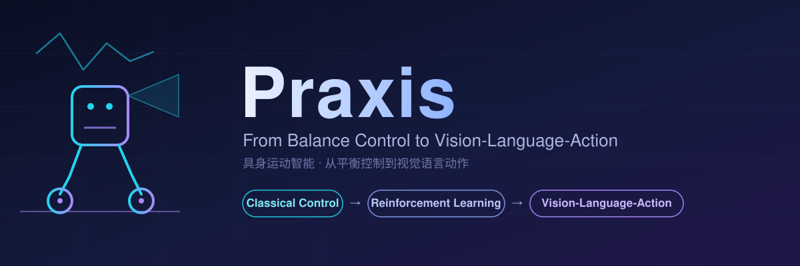
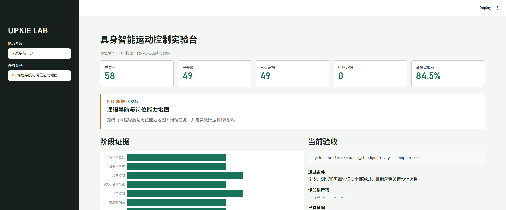
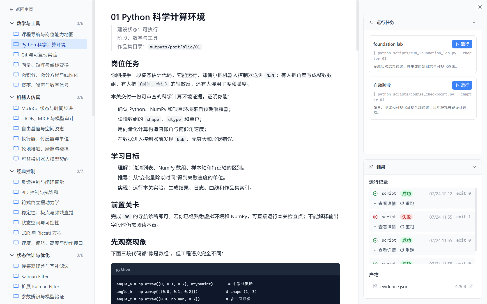
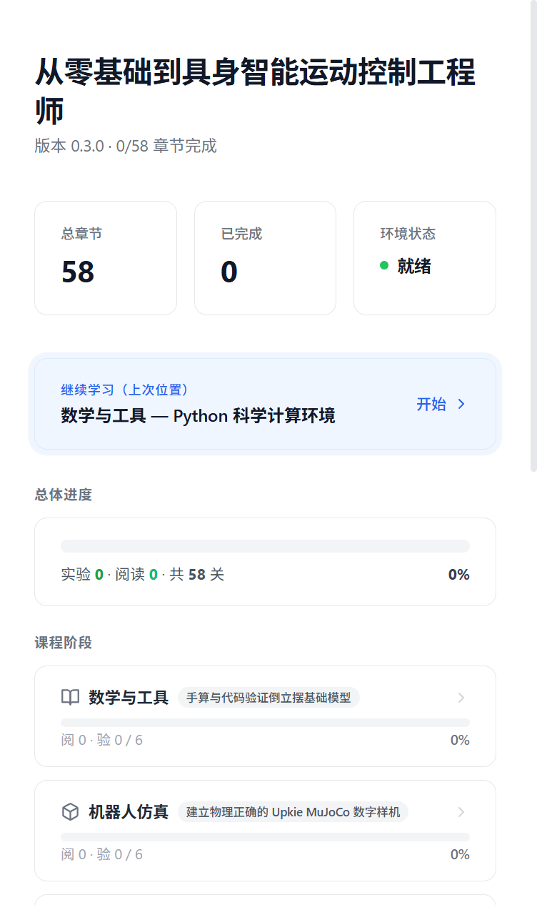
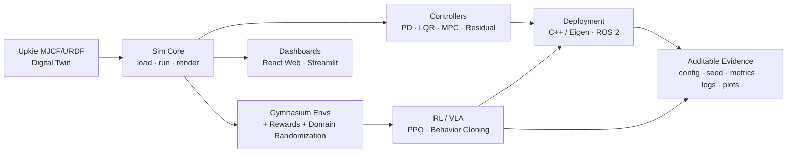

<div align="center">



# LocoVLA

### From Balance Control to Vision-Language-Action

**Learn robot control → RL → VLA, one runnable lesson at a time.**<br/>
**从平衡控制到视觉语言动作，一次一节可运行的课，练出岗位级具身控制能力。**

*An open curriculum & framework for **embodied locomotion intelligence** — built on the [Upkie](https://github.com/upkie/upkie) wheeled-biped robot and [MuJoCo](https://mujoco.org/).*

*一套面向**具身运动智能**的开源课程与框架 —— 以 Upkie 轮足机器人 + MuJoCo 仿真为教学载体。*

[](https://github.com/Yhx888/LocoVLA/actions/workflows/ci.yml)
[](LICENSE)
[](https://www.python.org/)
[](https://mujoco.org/)
[](cpp/)
[](#contributing--参与贡献)
[](https://github.com/Yhx888/LocoVLA/stargazers)

**[English](#english) · [简体中文](#简体中文)**

</div>

---

<div align="center">



<em>Interactive experiment bench — progress, stage evidence &amp; per-lesson acceptance · 交互式实验台：进度总览、阶段证据与逐关验收</em>

</div>

<details>
<summary>📸 <b>More screenshots · 更多截图</b></summary>

<br/>

<div align="center">



<em>Lesson view — objectives, prerequisites, runnable tasks &amp; evidence · 关卡详情：学习目标、前置关卡、可运行任务与证据</em>

<br/><br/>



<em>Responsive mobile layout · 移动端自适应布局</em>

</div>

</details>

---

<a name="english"></a>

## English

**LocoVLA** (*Locomotion + Vision‑Language‑Action*) is a reproducibility-first, 58-lesson journey that takes you from high‑school math and zero programming all the way to a **job-ready embodied control system**. You build every layer of the stack on a physically correct digital twin: modeling → classical control → state estimation → reinforcement learning → vision‑language‑action → C++/ROS 2 deployment.

Nothing is marked "done" by clicking through slides. Every milestone ships **fixed-seed, auditable evidence** — config, git commit, seed, metrics, pass criteria, raw logs, and plots.

### ✨ Highlights

- 🎓 **58 hands-on lessons** across 8 stages (`00–47` + hardware elective `H01–H10`), each with acceptance tests.
- 🤖 **Physically correct digital twin** — Upkie v2 free‑floating base (`nq=13, nv=12, nu=6`), wheel torque control (`±1 N·m`).
- 🎛️ **Classical control baselines** — PD, LQR, and constrained MPC with a closed-loop MuJoCo solve.
- 📡 **State estimation** — EKF / UKF pitch estimation with measurable improvement over raw sensors.
- 🧠 **Reproducible RL** — PPO and residual-RL benchmarks with paired-disturbance comparisons against classical baselines.
- 👁️ **Applied VLA** — language-conditioned visual navigation + behavior cloning with a safe-stop control layer.
- 🛠️ **Real deployment path** — C++/Eigen (CMake + CTest) and ROS 2 (colcon) control chains.
- 📊 **Interactive dashboards** — a React + Vite + TypeScript course web app and a Streamlit experiment bench.
- 🔬 **Evidence discipline** — fixed-seed experiments must be reproducible or they don't count.

### 🧭 Curriculum at a glance

| Stage | Lessons | Theme | Capstone deliverable |
|:---:|:---:|---|---|
| 0 | `00–05` | Math & Tooling | Hand-derive & code-verify the inverted-pendulum baseline |
| 1 | `06–11` | Robot Simulation | A physically correct Upkie MuJoCo digital twin |
| 2 | `12–18` | Classical Control | PD / LQR / velocity-control comparison experiments |
| 3 | `19–24` | State Estimation & Optimization | Noisy-sensor estimation + constrained MPC |
| 4 | `25–31` | Learning-based Control | Reproducible PPO & residual-control benchmarks |
| 5 | `32–37` | Applied VLA | Language-conditioned navigation & stable parking |
| 6 | `38–43` | Engineering & Deployment | Port the control chain to C++ and ROS 2 |
| 7 | `44–47` | Capstone | A complete embodied control system & portfolio |
| H | `H01–H10` | Hardware Elective | Replicate & improve a desktop wheeled-biped |

> The single source of truth for lessons, prerequisites and acceptance criteria is [`configs/course/manifest.json`](configs/course/manifest.json).

### 🏗️ Architecture



### 🚀 Quick start

```bash
python -m venv .venv
# Windows: .\.venv\Scripts\Activate.ps1
source .venv/bin/activate
python -m pip install --upgrade pip
pip install -r requirements.txt -r requirements-dev.txt

python scripts/01_check_model.py   # audit the robot model
pytest                             # run the acceptance test suite
```

Launch the interactive experiment bench:

```bash
streamlit run dashboard/app.py     # open http://localhost:8501
```

### 🔬 Real experiment entry points

```bash
# Classical balance & velocity control
python scripts/02_run_pd_balancer.py --duration 5 --no-viewer
python scripts/03_run_lqr_balancer.py --duration 5 --no-viewer

# Fast PPO loop & evaluation
python scripts/06_train_ppo_standing.py --total-timesteps 256 --profile smoke --seed 0
python scripts/08_eval_policy.py --mode classic --episodes 1 --seed 0 --record

# VLA: demos → behavior cloning → fixed test set
python scripts/35_generate_vla_demos.py --episodes 1 --max-steps 50
python scripts/36_train_behavior_cloning.py
python scripts/37_eval_vla.py --max-steps 5000 --seed 0

# Triple-gated lesson acceptance (planned lessons are refused)
python scripts/course_checkpoint.py --chapter 19 --seed 0
```

### 🧰 Tech stack

`Python 3.11` · `MuJoCo` · `Gymnasium` · `Stable-Baselines3 / PyTorch` · `NumPy / SciPy` · `C++17 / Eigen / CMake / CTest` · `ROS 2 (colcon)` · `React + Vite + TypeScript` · `Streamlit`

### 📁 Repository layout

```
assets/     Robot models (MJCF/URDF) & terrains
configs/    Control / env / RL / robot / course configs
cpp/        C++ control library (Eigen + CMake + CTest)
dashboard/  Streamlit bench (app.py) + React web app (web/)
docs/       Guides, design notes, syllabus
scripts/    Lesson entry points (00–47 + engineering/VLA/hardware)
src/        Core library (upkie_mujoco_course)
tests/      Acceptance & regression tests
tutorials/  v2 course text (00–47 + H01–H10)
```

### 🤝 Contributing / 参与贡献

Issues and PRs are welcome! Please keep code simple, prefer making tutorials runnable before optimizing algorithms, and never hide failures, inflate results, or bypass pass criteria. Fixed-seed experiments must be reproducible.

### 📜 License & acknowledgements

Released under the [MIT License](LICENSE). Third-party assets under `assets/upkie/upkie_description/` retain their own licenses. Built on the excellent [Upkie](https://github.com/upkie/upkie) robot and the [MuJoCo](https://mujoco.org/) physics engine.

---

<a name="简体中文"></a>

## 简体中文

**LocoVLA**（*Locomotion + Vision‑Language‑Action*，运动控制 + 视觉语言动作）是一套**以可复现证据为核心**的 58 关课程，带你从高中数学与零编程基础，一路走到**岗位级的具身控制系统**。你会在一个物理正确的数字样机上，亲手搭建每一层技术栈：建模 → 经典控制 → 状态估计 → 强化学习 → 视觉语言动作（VLA）→ C++/ROS 2 工程部署。

课程不靠"看完幻灯片"来判定完成。每个里程碑都会产出**固定随机种子、可审查的证据** —— 配置、Git commit、seed、指标、通过条件、原始日志和图表。

### ✨ 核心特性

- 🎓 **58 关动手实践**，覆盖 8 个阶段（`00–47` + 硬件选修 `H01–H10`），每关都有验收测试。
- 🤖 **物理正确的数字样机** —— Upkie v2 自由基座（`nq=13, nv=12, nu=6`），轮端力矩控制（`±1 N·m`）。
- 🎛️ **经典控制基线** —— PD、LQR 与受约束 MPC，含 MuJoCo 闭环求解。
- 📡 **状态估计** —— EKF / UKF 俯仰估计，相对原始传感器有可量化改善。
- 🧠 **可复现强化学习** —— PPO 与残差 RL 基准，含与经典基线的配对扰动对比。
- 👁️ **应用型 VLA** —— 语言条件视觉导航 + 行为克隆，带安全停机控制层。
- 🛠️ **真实部署链路** —— C++/Eigen（CMake + CTest）与 ROS 2（colcon）控制链。
- 📊 **交互式仪表盘** —— React + Vite + TypeScript 课程 Web 与 Streamlit 实验台。
- 🔬 **证据原则** —— 固定 seed 实验必须可复现，否则不计入课程证据。

### 🧭 课程一览

| 阶段 | 关卡 | 主题 | 毕业项目 |
|:---:|:---:|---|---|
| 0 | `00–05` | 数学与工具 | 手算并代码验证倒立摆基线模型 |
| 1 | `06–11` | 机器人仿真 | 物理正确的 Upkie MuJoCo 数字样机 |
| 2 | `12–18` | 经典控制 | PD / LQR / 速度控制对比实验 |
| 3 | `19–24` | 状态估计与优化 | 带噪声状态估计 + 受约束 MPC |
| 4 | `25–31` | 学习控制 | 可复现的 PPO 与残差控制基准 |
| 5 | `32–37` | 应用型 VLA | 语言条件视觉导航与稳定停车 |
| 6 | `38–43` | 工程部署 | 将控制链路迁移到 C++ 与 ROS 2 |
| 7 | `44–47` | 岗位毕业项目 | 完整具身控制系统与作品集 |
| H | `H01–H10` | 硬件选修 | 复刻并改进桌面轮足平衡机器人 |

> 课程清单、先修关系与验收条件的唯一权威来源是 [`configs/course/manifest.json`](configs/course/manifest.json)。

### 🚀 快速开始

```powershell
python -m venv .venv
.\.venv\Scripts\Activate.ps1
python -m pip install --upgrade pip
pip install -r requirements.txt -r requirements-dev.txt

python scripts/01_check_model.py   # 审计机器人模型
pytest                             # 运行验收测试套件
```

启动交互式实验台：

```powershell
streamlit run dashboard/app.py     # 浏览器打开 http://localhost:8501
```

### 🔬 真实实验入口

```powershell
# 经典平衡与速度控制
python scripts/02_run_pd_balancer.py --duration 5 --no-viewer
python scripts/03_run_lqr_balancer.py --duration 5 --no-viewer

# PPO 快速链路与评估
python scripts/06_train_ppo_standing.py --total-timesteps 256 --profile smoke --seed 0
python scripts/08_eval_policy.py --mode classic --episodes 1 --seed 0 --record

# VLA：示范 → 行为克隆 → 固定测试集
python scripts/35_generate_vla_demos.py --episodes 1 --max-steps 50
python scripts/36_train_behavior_cloning.py
python scripts/37_eval_vla.py --max-steps 5000 --seed 0

# 关卡三重验收（规划中的关卡会拒绝完成）
python scripts/course_checkpoint.py --chapter 19 --seed 0
```

### 🧰 技术栈

`Python 3.11` · `MuJoCo` · `Gymnasium` · `Stable-Baselines3 / PyTorch` · `NumPy / SciPy` · `C++17 / Eigen / CMake / CTest` · `ROS 2 (colcon)` · `React + Vite + TypeScript` · `Streamlit`

### 📁 目录结构

```
assets/     机器人模型（MJCF/URDF）与地形
configs/    控制 / 环境 / 强化学习 / 机器人 / 课程配置
cpp/        C++ 控制库（Eigen + CMake + CTest）
dashboard/  Streamlit 实验台（app.py）+ React 前端（web/）
docs/       操作指南、设计文档、课程地图
scripts/    章节入口脚本（00–47 + 工程/VLA/硬件）
src/        核心代码库（upkie_mujoco_course）
tests/      验收与回归测试
tutorials/  v2 课程正文（00–47 + H01–H10）
```

### 🔒 证据原则

所有实验结果至少包含配置、Git commit、seed、指标、通过条件、日志和可视化路径。视觉说明发生了什么，日志给出时间与数值，测试负责重复判定。课程不隐藏失败、不夸大算法效果，也不允许通过放宽阈值把未完成章节包装成完成。

### 📜 许可证与致谢

本项目基于 [MIT 许可证](LICENSE) 发布。`assets/upkie/upkie_description/` 下的第三方资产保留各自的许可证。项目构建于优秀的 [Upkie](https://github.com/upkie/upkie) 机器人与 [MuJoCo](https://mujoco.org/) 物理引擎之上。
