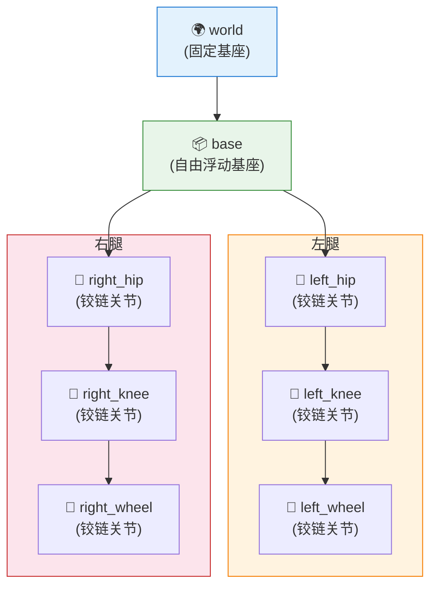

# 01 机器人模型审计

> ⚠️ 本文档对应 v1 课程结构。v2 正文请参见 `tutorials/v2/`。本文档所有 `nq/nv` 数值均为 v1 旧值（`nq=6, nv=6`）；v2 实际为 `nq=13, nv=12`（自由基座 7 + 6 关节），请勿用于 v2 验证。

> 📗 **难度**：★★☆☆☆（基础）— 需要理解模型结构和执行审计脚本
> 对应仓库 commit: d2c1f6f
> 最后验证日期: 2026-07-03
> 运行环境: Windows + Python 3.11 + MuJoCo

---

## 1. 本节学习目标

完成本节后，你应该能够：

- **理解** 为什么控制前必须做模型审计
- **检查** Upkie 模型的所有组件（body、joint、actuator、sensor）
- **生成** 模型审计报告
- **验证** joint/actuator 映射的正确性

---

## 2. 前置知识

开始本节前，建议你已经完成：

- Lesson 00: Getting Started

你需要理解的概念：

- MuJoCo 模型结构（body、joint、actuator）
- URDF/MJCF 文件格式基础

---

## 3. 本节涉及的文件

| 文件 | 作用 |
|------|------|
| `scripts/01_check_model.py` | 模型审计入口脚本 |
| `src/upkie_mujoco_course/model/` | 模型加载和映射模块 |
| `configs/robot/upkie.json` | 机器人配置文件 |
| `tests/test_model_loads.py` | 模型加载测试 |
| `tests/test_joint_mapping.py` | 关节映射测试 |
| `tests/test_actuator_mapping.py` | 执行器映射测试 |

---

## 4. 核心概念：为什么需要模型审计

### 4.1 问题背景

在编写控制器之前，必须了解模型的结构。错误的 joint/actuator 映射会导致：

1. **控制失败**：发送错误的控制指令
2. **仿真崩溃**：访问不存在的关节
3. **结果不可复现**：每次运行结果不同

### 4.2 模型审计的关键检查项

| 检查项 | 说明 | 重要性 |
|--------|------|--------|
| base body name | 机器人基座名称 | ⭐⭐⭐⭐⭐ |
| wheel joint names | 轮子关节名称 | ⭐⭐⭐⭐⭐ |
| hip/knee joint names | 腿部关节名称 | ⭐⭐⭐⭐⭐ |
| actuator names | 执行器名称 | ⭐⭐⭐⭐⭐ |
| joint limits | 关节限制 | ⭐⭐⭐⭐ |
| mass 和 inertia | 质量和惯量 | ⭐⭐⭐ |
| sensor names | 传感器名称 | ⭐⭐⭐ |

### 4.3 模型结构示意

> 📌 **飞书用户请使用"文本绘图小组件"插入以下图表**



---

## 5. 代码详解

### 5.1 入口脚本

**文件**：`scripts/01_check_model.py`

```python
"""模型审计脚本。

检查 Upkie 模型的所有组件，生成审计报告。
"""
from __future__ import annotations

import argparse
import sys
from pathlib import Path

ROOT = Path(__file__).resolve().parents[1]
sys.path.insert(0, str(ROOT / "src"))

from upkie_mujoco_course.model.audit import audit_model


def main() -> None:
    parser = argparse.ArgumentParser(description="模型审计")
    parser.add_argument("--config", type=str, default="configs/robot/upkie.json",
                        help="机器人配置文件路径")
    args = parser.parse_args()

    # 运行模型审计
    report = audit_model(args.config)

    # 输出审计结果
    print(f"模型审计完成:")
    print(f"  - nq={report.nq}, nv={report.nv}, nu={report.nu}")
    print(f"  - {len(report.bodies)} bodies")
    print(f"  - {len(report.joints)} joints")
    print(f"  - {len(report.actuators)} actuators")
    print(f"  - 审计报告: {report.output_dir}")


if __name__ == "__main__":
    main()
```

### 5.2 模型加载流程

**文件**：`src/upkie_mujoco_course/model/loader.py`

```python
"""模型加载器。"""
from __future__ import annotations

from pathlib import Path

import mujoco


def load_model(config_path: str) -> mujoco.MjModel:
    """从配置文件加载 MuJoCo 模型。

    Args:
        config_path: 机器人配置文件路径（JSON 格式）

    Returns:
        MuJoCo 模型对象
    """
    # 读取配置
    config = load_config(config_path)
    model_path = config["model_path"]

    # 加载 MJCF 模型
    model = mujoco.MjModel.from_xml_path(model_path)

    return model
```

### 5.3 审计检查逻辑

**文件**：`src/upkie_mujoco_course/model/audit.py`

```python
"""模型审计模块。"""
from __future__ import annotations

from dataclasses import dataclass
from pathlib import Path

import mujoco
import numpy as np


@dataclass
class ModelReport:
    """模型审计报告。"""
    nq: int  # 关节位置维度
    nv: int  # 关节速度维度
    nu: int  # 控制输入维度
    bodies: list[str]  # body 名称列表
    joints: list[dict]  # 关节信息列表
    actuators: list[dict]  # 执行器信息列表
    sensors: list[dict]  # 传感器信息列表
    output_dir: Path  # 输出目录


def audit_model(config_path: str) -> ModelReport:
    """执行模型审计。

    Args:
        config_path: 机器人配置文件路径

    Returns:
        审计报告
    """
    # 加载模型
    model = load_model(config_path)

    # 提取 body 信息
    bodies = []
    for i in range(model.nbody):
        name = model.body(i).name
        bodies.append(name)

    # 提取 joint 信息
    joints = []
    for i in range(model.njnt):
        joint = model.joint(i)
        joints.append({
            "name": joint.name,
            "type": joint.type,
            "range": joint.range.tolist(),
        })

    # 提取 actuator 信息
    actuators = []
    for i in range(model.nu):
        actuator = model.actuator(i)
        actuators.append({
            "name": actuator.name,
            "type": actuator.type,
        })

    # 生成报告
    report = ModelReport(
        nq=model.nq,
        nv=model.nv,
        nu=model.nu,
        bodies=bodies,
        joints=joints,
        actuators=actuators,
        sensors=[],
        output_dir=Path("outputs/model_audit"),
    )

    # 保存报告
    save_report(report)

    return report
```

---

## 6. 运行与验证

### 6.1 运行命令

```powershell
# 基础运行
python scripts/01_check_model.py

# 指定配置文件
python scripts/01_check_model.py --config configs/robot/upkie.json
```

### 6.2 预期输出

```
=== Upkie 模型审计 ===
nq=6, nv=6, nu=6

Bodies (8):
  - world
  - base
  - left_hip
  - left_knee
  - left_wheel
  - right_hip
  - right_knee
  - right_wheel

Joints (6):
  - left_hip: hinge, range=[-0.5, 0.5]
  - left_knee: hinge, range=[-1.5, 0.0]
  - left_wheel: hinge, range=free
  - right_hip: hinge, range=[-0.5, 0.5]
  - right_knee: hinge, range=[-1.5, 0.0]
  - right_wheel: hinge, range=free

Actuators (6):
  - left_hip_servo: position
  - left_knee_servo: position
  - left_wheel_motor: velocity
  - right_hip_servo: position
  - right_knee_servo: position
  - right_wheel_motor: velocity

审计报告已保存到: outputs/model_audit/
```

### 6.3 输出文件

- `outputs/model_audit/upkie_model_report.md`：Markdown 格式的模型报告
- `outputs/model_audit/upkie_joint_table.csv`：关节信息表格
- `outputs/model_audit/upkie_actuator_table.csv`：执行器信息表格

---

## 7. 配置文件详解

**文件**：`configs/robot/upkie.json`

```json
{
  "model_path": "assets/upkie/upkie.xml",
  "base_body": "base",
  "root_joint": "free",
  "wheel_joints": ["left_wheel", "right_wheel"],
  "leg_joints": {
    "left_hip": "left_hip",
    "left_knee": "left_knee",
    "right_hip": "right_hip",
    "right_knee": "right_knee"
  },
  "actuators": {
    "left_hip_servo": "position",
    "left_knee_servo": "position",
    "left_wheel_motor": "velocity",
    "right_hip_servo": "position",
    "right_knee_servo": "position",
    "right_wheel_motor": "velocity"
  },
  "default_pose": {
    "stand": {
      "left_hip": 0.0,
      "left_knee": 0.0,
      "right_hip": 0.0,
      "right_knee": 0.0
    },
    "crouch": {
      "left_hip": -0.3,
      "left_knee": -0.8,
      "right_hip": -0.3,
      "right_knee": -0.8
    }
  }
}
```

**配置说明**：

| 字段 | 说明 |
|------|------|
| `model_path` | MJCF 模型文件路径 |
| `base_body` | 基座 body 名称 |
| `root_joint` | 根关节类型（free/fixed） |
| `wheel_joints` | 轮子关节名称列表 |
| `leg_joints` | 腿部关节映射 |
| `actuators` | 执行器名称和类型 |
| `default_pose` | 默认姿态配置 |

---

## 8. 测试验证

### 8.1 运行测试

```powershell
# 模型加载测试
pytest tests/test_model_loads.py -v

# 关节映射测试
pytest tests/test_joint_mapping.py -v

# 执行器映射测试
pytest tests/test_actuator_mapping.py -v

# 全部测试
pytest tests/ -v
```

### 8.2 测试内容

| 测试文件 | 测试内容 |
|----------|----------|
| `test_model_loads.py` | 模型能正确加载，nq/nv/nu 正确 |
| `test_joint_mapping.py` | 关节能正确映射，名称匹配 |
| `test_actuator_mapping.py` | 执行器能正确映射，类型匹配 |
| `test_config_loads.py` | 配置文件能正确解析 |

---

## 9. 常见问题

| 现象 | 可能原因 | 解决方法 |
|------|----------|----------|
| `KeyError: joint not found` | joint name 不匹配 | 检查 `configs/robot/upkie.json` |
| `ValueError: actuator mismatch` | actuator 数量不对 | 重新运行模型审计 |
| `FileNotFoundError` | 模型文件不存在 | 检查 `assets/upkie/` 目录 |
| `mujoco.FatalError` | MJCF 格式错误 | 检查 XML 文件语法 |

---

## 10. 面试题精选

### Q1：为什么控制前必须做模型审计？

**A**：
1. **避免错误映射**：错误的 joint/actuator 映射会导致控制指令发送到错误的关节
2. **验证模型完整性**：确保所有必要的组件都存在
3. **了解模型参数**：关节限制、质量、惯量等参数影响控制设计
4. **可复现性**：记录模型版本，确保结果可复现

### Q2：MJCF 和 URDF 的区别是什么？

**A**：

| 维度 | MJCF | URDF |
|------|------|------|
| 格式 | XML（MuJoCo 专用） | XML（通用） |
| 功能 | 支持更多 MuJoCo 特性 | 标准机器人描述 |
| 扩展性 | 支持自定义属性 | 扩展性有限 |
| 适用场景 | MuJoCo 仿真 | 多仿真器兼容 |

### Q3：如何验证模型映射的正确性？

**A**：
1. **单元测试**：编写测试验证每个关节/执行器的映射
2. **可视化检查**：在 MuJoCo viewer 中观察关节运动
3. **数值验证**：读取关节角度，验证是否符合预期
4. **对比验证**：与官方模型对比参数

---

## 11. 延伸学习

### 11.1 进阶主题

1. **URDF 模型创建**：学习如何创建自定义机器人模型
2. **模型参数辨识**：如何从真实机器人获取模型参数
3. **模型简化**：如何简化复杂模型以提高仿真效率

### 11.2 推荐阅读

1. **MuJoCo XML 文档**：https://mujoco.org/documentation#XML
2. **URDF 规范**：http://wiki.ros.org/urdf

---

## 12. 下一节预告

下一节将学习：
- MuJoCo 仿真基础
- MjModel 和 MjData 的使用
- 仿真步进和传感器读取
