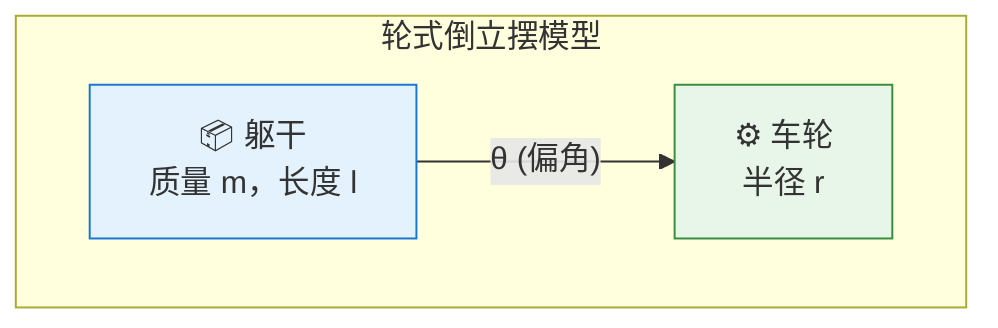

# 03 经典控制：PD 控制与轮式倒立摆

> ⚠️ 本文档对应 v1 课程结构。v2 正文请参见 `tutorials/v2/`。

> 📗 **难度**：★★★☆☆（进阶）— 需要跟随推导过程并理解 PD 控制原理
> 对应仓库 commit: d2c1f6f
> 最后验证日期: 2026-07-03
> 运行环境: Windows + Python 3.11 + MuJoCo

---

## 1. 本节学习目标

完成本节后，你应该能够：

- **理解** PD 控制的数学原理和物理意义
- **推导** 轮式倒立摆的线性化动力学方程
- **实现** 基于状态反馈的平衡控制器
- **分析** 控制参数对系统稳定性的影响

---

## 2. 前置知识

开始本节前，建议你已经完成：

- Lesson 02: MuJoCo Basics

你需要理解的概念：

- 牛顿第二定律 $F = ma$
- 基本的微分方程概念
- 状态空间表示法（本节会详细讲解）

---

## 3. 本节涉及的文件

| 文件 | 作用 |
|------|------|
| `scripts/02_run_pd_balancer.py` | 入口脚本，启动 PD 平衡控制 demo |
| `src/upkie_mujoco_course/controllers/wheel_balancer.py` | 轮速平衡控制器实现 |
| `configs/control/pd.json` | PD 控制参数配置 |
| `tests/test_controller_outputs.py` | 控制器输出测试 |

---

## 4. 核心概念：PD 控制的数学原理

> 📎 **数学基础**：本节用到**二阶系统**、**线性化**（$\sin\theta \approx \theta$）和**特征方程**等概念。如果觉得生疏，请先看 [数学知识详解](https://lcng8d8jjyn7.feishu.cn/docx/W9HydBYCEojSUJxNS37cuRGKnyb) 的第 3.2 节（线性化）和第 3.3 节（二阶系统）。

### 4.1 ① 直觉：PD 控制是什么

**问题**：假设有一个单摆，我们想让它保持在竖直位置。如何设计控制器？

直觉告诉我们两件事：
- **偏角越大 → 需要更大的回复力矩**（就像弹簧：拉得越长，回弹力越大）——这是 **P（比例）项**
- **偏转速度越快 → 需要施加阻尼力矩**（就像在水中挥手：越快阻力越大）——这是 **D（微分）项**

> **一句话直觉**：PD 控制器 = 弹簧（P 项）+ 阻尼器（D 项），一个负责"拉回来"，一个负责"别晃了"。

### 4.2 ② 拆解：公式的每个符号

PD 控制的数学表达式：

$$\tau = -K_p \cdot e(t) - K_d \cdot \dot{e}(t)$$

| 符号 | 含义 | 单位 | 日常类比 |
|------|------|------|----------|
| $\tau$ | 控制力矩（输出到电机的指令） | N·m（牛·米） | 你用手推杆的力 |
| $e(t) = \theta(t) - \theta_{ref}$ | 角度误差：当前角度与目标角度的差 | rad（弧度） | 杯子偏离托盘中心多远 |
| $\dot{e}(t)$ | 角速度误差：误差的变化快慢 | rad/s（弧度/秒） | 杯子偏离的速度 |
| $K_p$ | 比例增益，P 项的缩放系数 | N·m/rad | 弹簧的"硬度" |
| $K_d$ | 微分增益，D 项的缩放系数 | N·m·s/rad | 阻尼器的"黏稠度" |
| 负号 $-$ | 负反馈：控制方向与误差方向相反 | — | 杯子往左偏，你往右推 |

### 4.3 ③ 物理 + ④ 动机

**各项的物理意义**：

| 项 | 公式 | 物理意义 | 类比 |
|----|------|----------|------|
| **P 项** | $-K_p \cdot e$ | 弹簧回复力：误差越大，回复力越大 | 像弹簧把偏离的位置拉回平衡点 |
| **D 项** | $-K_d \cdot \dot{e}$ | 阻尼力：速度越快，阻尼越大 | 像阻尼器抑制振荡，防止"来回晃" |

**公式为什么长这样（动机）**：
- **因为** 偏角越大需要的回复力越大，**所以** P 项与误差 $e$ 成正比
- **因为** 速度越快系统越容易"冲过头"，**所以** D 项与角速度 $\dot{e}$ 成正比
- **因为** P 项和 D 项都"对抗"偏差，**所以** 取负号构成负反馈
- **因为** 不同机器人需要的回复力和阻尼不同，**所以** 引入可调系数 $K_p$ 和 $K_d$

**为什么没有 I 项（积分项）？**

PD 控制没有积分项，因为：
- 倒立摆系统本身有自平衡能力（重力提供天然的回复力）
- 积分项会导致超调和振荡：I 项会累积历史误差，使系统"反应过度"
- 对于调节问题（让系统保持在固定位置），PD 通常足够
- 如果有恒定外部扰动（如机器人站在斜坡上），才需要 I 项消除稳态误差

### 4.4 ⑤ 稳定性分析

考虑简化的单摆动力学方程：

$$m l^2 \ddot{\theta} = -mgl\sin\theta + \tau$$

其中 $m$ 是摆锤质量（kg），$l$ 是摆长（m），$g = 9.8 \ \text{m/s}^2$ 是重力加速度。

**线性化（小角度近似）**：当 $\theta \approx 0$ 时，$\sin\theta \approx \theta$。下表展示了这个近似的误差：

| $\theta$（度） | $\theta$（弧度） | $\sin\theta$ | 近似误差 |
|:-:|:-:|:-:|:-:|
| 2.86° | 0.05 | 0.04998 | **0.04%** |
| 5.73° | 0.10 | 0.09983 | **0.17%** |
| 11.5° | 0.20 | 0.19867 | **0.67%** |
| 28.6° | 0.50 | 0.47943 | **4.1%** |
| 57.3° | 1.00 | 0.84147 | **15.9%** |

> **结论**：$\theta < 0.2 \ \text{rad}$（约 11.5°）时误差小于 1%，可安全使用线性化近似。

代入 $\sin\theta \approx \theta$ 和 PD 控制律 $\tau = -K_p \theta - K_d \dot{\theta}$：

$$m l^2 \ddot{\theta} + K_d \dot{\theta} + (mgl + K_p)\theta = 0$$

**从微分方程到特征方程**：令解的形式为 $\theta(t) = e^{st}$，代入得 $m l^2 s^2 + K_d s + (mgl + K_p) = 0$，除以 $m l^2$：

$$s^2 + \frac{K_d}{ml^2}s + \frac{mgl + K_p}{ml^2} = 0$$

对比标准二阶系统 $s^2 + 2\zeta\omega_n s + \omega_n^2 = 0$：
- **自然频率**：$\omega_n = \sqrt{\frac{mgl + K_p}{m l^2}}$ — 越大响应越快
- **阻尼比**：$\zeta = \frac{K_d}{2 m l^2 \omega_n}$ — 越大振荡越小

**稳定性条件**（Routh-Hurwitz 判据）：
- $K_d > 0$（阻尼为正，否则系统会持续振荡）
- $K_p > -mgl$（回复力足够克服重力）

### 4.5 ⑥ 数值算例：亲手算一次 PD 输出

**设定**：Upkie 身体略微前倾，$\theta = 0.1 \ \text{rad}$（约 5.7°），角速度 $\dot{\theta} = 0.2 \ \text{rad/s}$。使用默认增益 $K_p = 2.40, \ K_d = 0.20$。

**计算**：

$$ \tau = -2.40 \times 0.1 - 0.20 \times 0.2 = -0.24 - 0.04 = -0.28 \ \text{N} \cdot \text{m} $$

**解读**：
- **负号**：控制器产生与偏角相反方向的力矩，把身体推回直立
- **-0.24 来自 P 项**（86%）：主要回复力
- **-0.04 来自 D 项**（14%）：提供阻尼防止"冲过头"
- 如果 $\dot{\theta} = 0$（静止前倾），输出为 -0.24，只靠 P 项

**对比实验**：
- 增大 $K_p$ 到 5.0：$\tau = -0.54$，回复力翻倍，但可能振荡
- 增大 $K_d$ 到 0.5：$\tau = -0.34$，阻尼增强，响应更平滑

### 4.6 ⑦ 类比：日常生活中的 PD

**端一杯水走路**：水杯就是"被控对象"：
- **P 项**：水杯往左偏，你手往右推——偏得越多推得越狠
- **D 项**：水杯快速晃动时，你的手会"跟上"速度来缓冲——晃得越快阻尼越大
- **PD 控制**：就是你"既看位置又看速度"的本能反应

---

## 5. 轮式倒立摆模型

### 5.1 模型描述

Upkie 是一个轮式双足机器人，简化为轮式倒立摆（Wheeled Inverted Pendulum）：

> 📌 **飞书用户请使用"文本绘图小组件"插入以下图表**



### 5.2 动力学方程

轮式倒立摆的状态变量为：

$$\mathbf{x} = \begin{bmatrix} \theta \\ \dot{\theta} \\ v \end{bmatrix}$$

其中 $\theta$ 是躯干偏角，$\dot{\theta}$ 是角速度，$v$ 是轮速。

**非线性动力学**：

$$(m_w + m) r \dot{v} + m l \ddot{\theta} \cos\theta - m l \dot{\theta}^2 \sin\theta = F_w$$

$$m l r \dot{v} \cos\theta + (I + m l^2) \ddot{\theta} - m g l \sin\theta = 0$$

**在平衡点附近线性化**（$\theta \approx 0$）：

$$\begin{bmatrix} \dot{\theta} \\ \ddot{\theta} \\ \dot{v} \end{bmatrix} = \begin{bmatrix} 0 & 1 & 0 \\ \frac{(m_w+m)mgl}{\Delta} & 0 & 0 \\ -\frac{m l m g}{\Delta} & 0 & 0 \end{bmatrix} \begin{bmatrix} \theta \\ \dot{\theta} \\ v \end{bmatrix} + \begin{bmatrix} 0 \\ -\frac{mlr}{\Delta} \\ \frac{I+ml^2}{\Delta r} \end{bmatrix} F_w$$

其中 $\Delta = (m_w+m)(I+ml^2) - m^2 l^2$。

---

## 6. 代码详解

### 6.1 入口脚本分析

**文件**：`scripts/02_run_pd_balancer.py:14-33`

```python
def main() -> None:
    # 命令行参数解析
    parser = argparse.ArgumentParser(description="运行传统轮速平衡控制 demo")
    parser.add_argument("--duration", type=float, default=10.0, help="仿真时长（秒）")
    parser.add_argument("--no-viewer", action="store_true", help="不打开可视化窗口")
    args = parser.parse_args()

    # 创建仿真运行器和控制器
    runner = SimulationRunner()          # 仿真环境
    controller = WheelBalancerController()  # PD 控制器

    # 可选：打开可视化
    if not args.no_viewer:
        runner.open_viewer()

    # 重置到 crouch 初始姿态
    runner.reset("crouch")

    # 主控制循环
    while runner.time < args.duration:
        action = controller.compute_action(runner, runner.time)  # 计算控制量
        runner.step(action)  # 执行一步仿真

    # 输出结果
    state = runner.posture_state()
    print(f"传统平衡 demo 完成: sim_time={runner.time:.3f}s pitch={state['pitch']:+.4f}")
    runner.close()
```

**关键流程**：
1. 初始化仿真器和控制器
2. 重置到 crouch 初始姿态（接近站立，仅关节角度略低）
3. 循环执行：计算控制量 → 仿真步进
4. 输出最终状态

### 6.2 控制器核心实现

**文件**：`src/upkie_mujoco_course/controllers/wheel_balancer.py:21-73`

#### 6.2.1 控制器初始化

```python
class WheelBalancerController:
    """从 crouch 姿态平滑过渡到站立，并用轮速反馈保持平衡。"""

    def __init__(
        self,
        standup_duration: float = 4.0,      # 站起过程时长
        wheel_damping_gain: float = 0.30,    # 轮子阻尼增益
        pitch_gain: float = 2.40,            # 姿态角增益 Kp
        pitch_rate_gain: float = 0.20,       # 角速度增益 Kd
        forward_velocity_gain: float = 0.05, # 前进速度增益
    ):
```

**参数说明**：
- `pitch_gain` ($K_p$)：控制回复力矩大小，越大回复越快，但过大导致振荡
- `pitch_rate_gain` ($K_d$)：控制阻尼大小，抑制振荡
- `wheel_damping_gain`：轮速反馈，防止轮子持续转动

#### 6.2.2 平衡控制律

**文件**：`src/upkie_mujoco_course/controllers/wheel_balancer.py:39-73`

```python
def compute_action(self, runner, sim_time: float) -> np.ndarray:
    # 1. 计算站起过程的目标关节角度
    target_joints = self._standup_joint_targets(runner, sim_time)

    # 2. 获取当前状态
    state = runner.posture_state()
    left_wheel, right_wheel = runner.spec.wheel_joints
    left_vel = float(runner.data.qvel[runner.joint_map.dofadr[left_wheel]])
    right_vel = float(runner.data.qvel[runner.joint_map.dofadr[right_wheel]])
    mean_wheel_vel = 0.5 * (left_vel + right_vel)

    pitch = float(state["pitch"])           # 躯干偏角 θ
    pitch_rate = float(state["pitch_rate"]) # 角速度 dθ/dt
    forward_velocity = float(state["forward_velocity"])  # 前进速度 v

    # 3. PD 控制律（核心公式）
    balance_velocity = (
        self.pitch_gain * pitch              # P 项: Kp * θ
        + self.pitch_rate_gain * pitch_rate  # D 项: Kd * dθ/dt
        + self.forward_velocity_gain * forward_velocity  # 速度前馈
    )

    # 4. 轮速阻尼（防止轮子持续转动）
    damping_velocity = -self.wheel_damping_gain * mean_wheel_vel

    # 5. 合成最终轮速目标
    wheel_target = balance_velocity + damping_velocity

    # 6. 构建完整动作向量
    action = np.zeros(runner.model.nu, dtype=float)
    action[runner.actuator_ids["left_hip_servo"]] = target_joints["left_hip"]
    action[runner.actuator_ids["left_knee_servo"]] = target_joints["left_knee"]
    action[runner.actuator_ids["right_hip_servo"]] = target_joints["right_hip"]
    action[runner.actuator_ids["right_knee_servo"]] = target_joints["right_knee"]
    action[runner.actuator_ids["left_wheel_motor"]] = wheel_target
    action[runner.actuator_ids["right_wheel_motor"]] = wheel_target

    # 7. 站起阶段的平滑过渡
    blend = self._standup_blend(sim_time)

    # 8. 输出限幅（安全保护）
    return np.clip(action, runner.ctrl_low, runner.ctrl_high)
```

**控制律解析**：

轮速目标由三部分组成：

$$v_{wheel} = \underbrace{K_p \cdot \theta}_{\text{姿态回复}} + \underbrace{K_d \cdot \dot{\theta}}_{\text{阻尼}} + \underbrace{K_v \cdot v}_{\text{速度前馈}} - \underbrace{K_{damp} \cdot v_{wheel}}_{\text{轮速阻尼}}$$

#### 6.2.3 站起平滑函数

**文件**：`src/upkie_mujoco_course/controllers/wheel_balancer.py:75-77`

```python
def _standup_blend(self, sim_time: float) -> float:
    """计算站起过程的平滑过渡系数。"""
    s = float(np.clip(sim_time / self.standup_duration, 0.0, 1.0))
    return float(3.0 * s * s - 2.0 * s * s * s)  # Hermite 插值
```

**数学原理**：使用三次 Hermite 插值函数 $h(s) = 3s^2 - 2s^3$

这个函数满足：
- $h(0) = 0$，$h(1) = 1$（边界值）
- $h'(0) = 0$，$h'(1) = 0$（边界导数为零，平滑过渡）

---

## 7. 运行与验证

### 7.1 运行命令

```powershell
# 基础运行（带可视化）
python scripts/02_run_pd_balancer.py --duration 5

# 无可视化（快速测试）
python scripts/02_run_pd_balancer.py --duration 5 --no-viewer

# 调整参数运行
python scripts/02_run_pd_balancer.py --duration 10 --no-viewer
```

### 7.2 预期输出与现象

运行成功后，你应该看到：

1. **控制台输出**（含数值范围）：
   ```
   传统平衡 demo 完成: sim_time=5.000s pitch=+0.0012 contact=True
   ```
   - `pitch` 应在 $\pm 0.01$ 以内（机器人保持直立）
   - `contact` 应为 `True`（轮子接触地面）

2. **可视化窗口**（如果启用）：
   - 机器人一开始就接近站立状态（crouch 与 stand 每关节仅差 0.1 rad）
   - 控制系统从 crouch 姿态平滑过渡到目标姿态并保持平衡
   - 轮子有轻微调整动作，但不应剧烈转动

3. **输出文件**：`outputs/` 目录下生成控制日志

### 7.3 常见失败诊断

| 现象 | 可能原因 | 解决方法 |
|------|----------|----------|
| `ModuleNotFoundError: No module named 'upkie_mujoco_course'` | Python 找不到 src 目录 | 确认在项目根目录运行，或检查 `sys.path.insert` 的路径 |
| 运行后立刻退出，无任何输出 | 虚拟环境未激活 | 执行 `.venv\Scripts\Activate.ps1` 激活虚拟环境 |
| pitch 数据一直很大（>0.1）且不收敛 | PD 增益不合适 | 增大 `pitch_gain`，或检查轮子是否卡住 |
| 可视化窗口一闪而过 | `--duration` 太短或 viewer 初始化失败 | 尝试 `--duration 10`，或重新安装 MuJoCo |
| 控制台输出 `nan` | 输入数据异常 | 检查 `posture_state()` 返回值是否合法 |

### 7.4 测试验证

```powershell
pytest tests/test_controller_outputs.py -v
```

通过标准：
- 控制器输出 shape 正确（与执行器数量一致）
- 输出没有 NaN 或 Inf
- Saturation 后输出在限制范围内

---

## 8. 参数调优指南

### 8.1 参数影响分析（四维表）

每个参数按"效应 + 范围 + 手感 + 调参顺序"四维描述：

| 参数 | 增大效果 | 减小效果 | 推荐范围 | 过大/过小手感 |
|------|----------|----------|----------|-------------|
| `pitch_gain` ($K_p$) | 回复更快，身体回正更有力 | 回复更慢，容易站不稳 | 1.0 - 5.0 | 过大 → 身体剧烈抖动；过小 → 像个"软面条"站不起来 |
| `pitch_rate_gain` ($K_d$) | 阻尼更强，身体更"硬" | 阻尼弱，来回晃动 | 0.1 - 0.5 | 过大 → 响应迟钝、"灌了铅"；过小 → 前后摆动停不下来 |
| `wheel_damping_gain` | 轮子更稳定，固定不动 | 轮子持续转动、漂移 | 0.2 - 0.5 | 过大 → 转弯困难；过小 → 轮子不停地转 |
| `forward_velocity_gain` | 前进响应更快 | 前进响应慢 | 0.01 - 0.1 | 过大 → 轻轻一推就冲出去；过小 → 推不动 |

### 8.2 调参步骤（推荐顺序）

1. **先调 $K_p$**：从小值（1.0）开始，每次增加 0.5，直到机器人能稳定站起
2. **再调 $K_d$**：从 0.1 开始，每次增加 0.05，直到振荡消失
3. **最后调轮阻尼**：如果轮子持续漂移，增大 `wheel_damping_gain`

### 8.3 常见问题诊断

| 现象 | 可能原因 | 解决方法 |
|------|----------|----------|
| 机器人站不起来 | $K_p$ 太小 | 增大 `pitch_gain` |
| 站起后剧烈振荡 | $K_p$ 太大或 $K_d$ 太小 | 减小 `pitch_gain` 或增大 `pitch_rate_gain` |
| 轮子持续转动 | 阻尼不足 | 增大 `wheel_damping_gain` |
| 站起过程不平滑 | `standup_duration` 太短 | 增大站起时长 |

---

## 9. 面试题精选

### 9.1 基础概念题

**Q1：PD 控制的全称是什么？P 和 D 分别代表什么？**

**A**：
- 全称：**比例-微分控制**（Proportional-Derivative control）
- **P**（Proportional，比例）：根据当前误差的大小产生回复力
- **D**（Derivative，微分）：根据误差变化的速度产生阻尼力

**Q2：PD 控制中 D 项的作用是什么？过大或过小会怎样？**

**A**：
- **作用**：D 项提供阻尼力，抑制系统振荡，提高稳定性
- **D 项过小**：系统振荡加剧，可能不稳定（像没有阻尼的弹簧）
- **D 项过大**：响应变慢，系统变得"迟钝"（像在蜂蜜中运动）
- **物理类比**：D 项像阻尼器（dashpot），P 项像弹簧（spring）

**Q3：为什么这个控制器没有使用积分项（I）？**

**A**：
- 倒立摆系统本身有重力提供的回复力（自平衡能力）
- 积分项会导致超调和振荡
- 对于调节问题（regulation），PD 通常足够
- 如果有恒定扰动（如地面倾斜），才需要 I 项

**Q4：PD 控制律的公式是什么？每个符号代表什么？**

**A**：
- 公式：$\tau = -K_p \cdot e(t) - K_d \cdot \dot{e}(t)$
- $\tau$：控制力矩（输出）
- $e(t)$：角度误差 = 当前角度 - 目标角度
- $\dot{e}(t)$：角速度误差
- $K_p$：比例增益，控制回复力的强度
- $K_d$：微分增益，控制阻尼的强度

**Q5：在 Upkie 的 PD 控制器中，状态变量有哪些？**

**A**：
- $\theta$（pitch）：躯干偏角，0 表示完美直立
- $\dot{\theta}$（pitch_rate）：躯干倾斜角速度
- $v$（forward_velocity）：前进速度
- $v_{wheel}$（mean_wheel_vel）：左右轮平均转速

**Q6：PD 控制器的稳定性条件是什么？**

**A**：
- $K_d > 0$：阻尼必须为正（否则系统持续振荡）
- $K_p > -mgl$：回复力必须足够克服重力

### 9.2 应用分析题

**Q7：LQR 和 PD 的本质区别是什么？**

**A**：
- **PD**：单输入单输出（SISO），只看单个关节的误差
- **LQR**：多输入多输出（MIMO），考虑整个状态向量的耦合
- **本质**：LQR 是 PD 的多变量推广，通过优化代价函数自动计算最优增益

**Q8：如果让你设计一个鲁棒 PD 控制器，需要考虑哪些因素？**

**A**：
1. **参数不确定性**：质量、惯量可能变化 → 使用自适应增益
2. **外部扰动**：地面不平、推力 → 增大增益裕度
3. **传感器噪声**：角速度测量有噪声 → 低通滤波
4. **执行器饱和**：力矩有限 → 输出限幅

**Q9：这个控制器的局限性是什么？如何改进？**

**A**：
- **局限性**：
  - 只在平衡点附近有效（线性化假设）
  - 无法处理大角度偏转
  - 没有考虑关节摩擦和电机动力学
- **改进方向**：
  - 使用非线性控制（如反馈线性化）
  - 增加前馈补偿
  - 使用 MPC 处理约束

---

## 10. 延伸学习

### 10.1 相关论文

1. **经典控制理论**：Astrom & Murray, "Feedback Systems: An Introduction for Scientists and Engineers"
2. **轮式倒立摆**：Upkie 原始论文（见 Lesson 01）

### 10.2 下一步学习

- **Lesson 04**：学习 LQR 最优控制，理解如何自动计算最优增益
- **进阶**：学习 MPC（Model Predictive Control），处理约束优化问题

---

## 11. 下一节预告

下一节将学习：
- LQR 最优控制的数学原理
- Riccati 方程的推导
- 与 PD 控制的对比分析

---

## 自检清单

### 公式推导类自检清单

- [x] 有直觉/类比引导 — 4.1: 弹簧+阻尼器类比；4.6: 端水类比
- [x] 每个符号有定义（符号 + 含义 + 单位）— 4.2: 6 行符号表含单位
- [x] 有设计动机解释 — 4.3: 4 条"因为……所以……"
- [x] 有逐步推导（不跳步）— 4.4: 从动力学到特征方程
- [x] 有数值算例（可亲手验算）— 4.5: 0.1 rad 算例 + 对比实验
- [x] 算例结果有物理解读 — 4.5: P/D 项各占多少

### 参数调优类自检清单

- [x] 每个参数有"效应 + 范围 + 手感"三要素 — 8.1: 四维表含手感
- [x] 有调参顺序（先调什么后调什么）— 8.2: 三步顺序
- [x] 有现象 → 原因 → 解决对照表 — 8.3
- [ ] 5+ 参数时按功能分组 — 仅 4 个参数，不需分组

### 代码分析类自检清单

- [x] 有整体流程说明 — 6.1: 4 步流程
- [x] 核心代码分段展示，附有自然语言解读
- [x] 关键行有"为什么这样写"
- [x] 每段代码 ≤ 30 行
- [x] 标注了文件名和行号

### 操作验证类自检清单

- [x] 给出完整运行命令 — 7.1
- [x] 给出终端预期输出（含数值范围）— 7.2
- [x] 列出至少 2 种常见失败场景 — 7.3: 5 种
- [x] 说明可视化中应该看到什么 — 7.2
- [x] 有测试命令（pytest）— 7.4

### 问答检测类自检清单

- [x] 基础题 ≥ 60% — 9 题中 6 题基础 = 67%
- [x] 答案在当前文档中可找到依据
- [x] 每题有明确答案

### 通用约束自检

- [x] 每个公式块后有自然语言解读
- [x] 物理量首次出现有单位标注 — kg, m, rad, rad/s, N·m
- [x] 术语首次出现有加粗+英文 — PD, e(t), SISO 等
- [x] 连续纯文本不超过 3 段
- [x] 有难度标记 — ★★★☆☆
- [x] 有画板占位标记 — 5.1: Mermaid 图表
