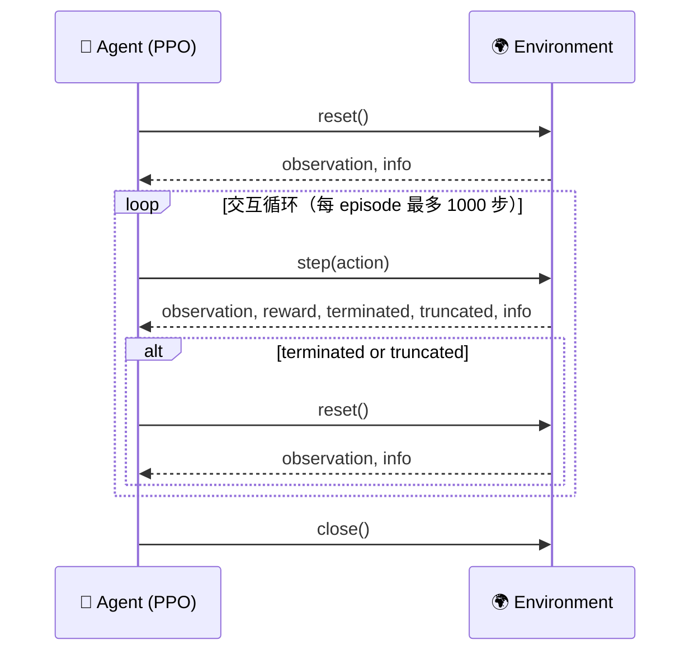
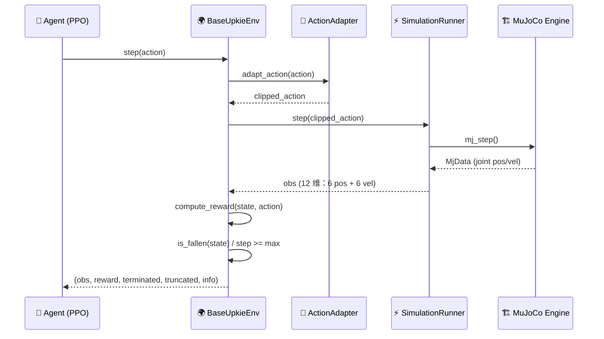

# 05 Gymnasium 环境封装

> ⚠️ 本文档对应 v1 课程结构。v2 正文请参见 `tutorials/v2/`。

> 📗 难度：★★★☆☆（进阶）— 需要理解接口设计、奖励函数和封装结构
> 对应仓库 commit: d2c1f6f
> 最后验证日期: 2026-06-26
> 运行环境: Windows + Python 3.11 + MuJoCo

---

## 1. 本节学习目标

完成本节后，你应该能够：

- **理解** **Gymnasium** 环境接口标准及其设计动机
- **实现** 自定义 Gymnasium 环境，将 MuJoCo 仿真封装为标准接口
- **设计** **观测空间**（observation space）、**动作空间**（action space）和**奖励函数**（reward function）
- **验证** 环境的正确性（shape 检查、`check_env` 合规检查）

---

## 2. 前置知识

开始本节前，建议你已经完成：

- Lesson 04: Control Interfaces

你需要理解的概念：

- **强化学习**（Reinforcement Learning）基本框架：智能体（agent）在环境（environment）中交互
- **MDP**（Markov Decision Process，马尔可夫决策过程）：状态 S、动作 A、奖励 R、转移概率 P 四元组
- Python 类继承（class inheritance）基础

> 提示：MDP 和强化学习的具体内容将在 Lesson 06 中深入展开，本节只需了解基本概念即可。

---

## 3. 本节涉及的文件

| 文件 | 作用 |
|------|------|
| `src/upkie_mujoco_course/envs/base_env.py` | **基础环境类**（BaseUpkieEnv），将 MuJoCo 仿真封装为 Gymnasium 环境 |
| `src/upkie_mujoco_course/envs/standing_env.py` | **站立环境**，继承 BaseUpkieEnv，专用于站立任务 |
| `src/upkie_mujoco_course/envs/action_adapter.py` | **动作适配器**，将 RL 策略输出的动作裁剪到执行器允许范围 |
| `src/upkie_mujoco_course/rewards/standing.py` | 站立**奖励函数**，包含存活、直立、高度三项 |
| `src/upkie_mujoco_course/rewards/regularization.py` | **正则化惩罚**（能耗 + 动作平滑） |
| `scripts/05_check_gym_env.py` | 环境检查脚本，验证接口正确性 |

---

## 4. 核心概念：Gymnasium 环境接口

> 📗 难度：★★☆☆☆（基础）

### 4.1 Gymnasium 标准接口

#### ① 大白话定义

**Gymnasium**（发音 /dʒɪmˈneɪziəm/）是**强化学习的标准接口协议**。它定义了环境和智能体之间的通话规则：

> 环境说："这是你当前的观测（observation），你打算怎么做？"
> 智能体说："这是我要执行的动作（action）。"
> 环境说："好的，执行完了。这是新的观测、获得的奖励（reward），以及任务是否结束。"

没有这个标准接口，每个 RL 算法都要自己实现一套环境交互方式，导致算法之间无法互通。有了 Gymnasium，PPO、SAC、DQN 等任意算法都能无缝对接同一个环境。

#### ② 拆解字母

Gymnasium 的核心只有 **4 个方法、2 个属性、2 个信号**：

| 项目 | 名称 | 作用 | 类比（餐厅点餐） |
|------|------|------|------------------|
| **方法** | `reset()` | 重置环境到初始状态，返回初始观测 | 客人入座，服务员递上菜单 |
| **方法** | `step(action)` | 执行动作，返回五元组 | 客人点菜，后厨做完后端上来 |
| **方法** | `close()` | 关闭环境，释放资源 | 结账离开，收拾桌子 |
| **属性** | `observation_space` | 定义观测空间的形状和范围 | 菜单上说"本店提供 X 种菜品" |
| **属性** | `action_space` | 定义动作空间的形状和范围 | 菜单上说"你可以选 Y 种搭配" |
| **信号** | `terminated` | 任务自然结束（成功或失败） | 客人吃饱了，主动说"结账" |
| **信号** | `truncated` | 人为截断（达到时间限制） | 餐厅打烊了，客人必须走 |

**五元组详解**（`step()` 的返回值）：

$$(\text{observation}, \text{reward}, \text{terminated}, \text{truncated}, \text{info})$$

解读（Unicode: (observation, reward, terminated, truncated, info)）—— step 返回的 5 个值按顺序分别是：新的观测、即时奖励、是否自然结束、是否被截断、额外信息字典。

#### ③ Upkie 实例映射

把抽象接口映射到我们的 Upkie 项目中：

| 抽象概念 | Upkie 实例 |
|----------|------------|
| `reset()` | 把 Upkie 重置到蹲姿（crouch），返回 12 维观测向量 |
| `step(action)` | 把 6 维控制向量（6 个执行器命令）发给 MuJoCo，执行一步仿真（0.002 秒） |
| `observation_space` | `Box(-inf, inf, (12,), float64)` — 6 个关节位置 + 6 个关节速度 |
| `action_space` | `Box(-1.0, 1.0, (6,), float64)` — 6 个执行器命令（已归一化到 [-1, 1]） |
| `terminated` | 机器人摔倒时（`pitch` 超过阈值） |
| `truncated` | 步数达到 `max_episode_steps`（默认 1000 步） |
| `reward` | 站立奖励 + 能耗惩罚 + 动作平滑惩罚 |

#### ④ 为什么有用

> "标准接口让 RL 生态可以复用。你写一个环境，所有算法都可以在上面跑；你写一个算法，所有标准环境都可以用它来训练。"

具体来说：

- **算法开发者**：不需要关心每个环境的内部实现，只要调用 `step()` 和 `reset()`
- **环境开发者**：不需要关心每个算法的细节，只要实现 `step()` 和 `reset()`
- **研究者**：可以在 `CartPole-v1` 上调试算法，然后直接在 `UpkieEnv` 上跑，零代码改动

---

### 4.2 Gymnasium 交互流程

> 📗 难度：★★☆☆☆（基础）

> 📌 **飞书用户请使用"文本绘图小组件"插入以下 Mermaid 时序图**



**核心交互模式**：Agent 调用 `reset()` 获得初始观测后，进入循环：Agent 根据观测选择动作 -> `step()` -> 环境执行并返回新观测和奖励。循环直到 `terminated=True`（摔倒）或 `truncated=True`（超步数），然后 `reset()` 开始新的一轮（episode）。

```python
import gymnasium as gym

# 创建环境
env = gym.make("CartPole-v1")

# 重置环境，获取初始观测
observation, info = env.reset()

# 交互循环（最多 1000 步）
for _ in range(1000):
    action = env.action_space.sample()  # 随机动作（仅示例，实际用策略网络）
    observation, reward, terminated, truncated, info = env.step(action)

    if terminated or truncated:
        observation, info = env.reset()  # 开始新 episode

env.close()
```

> 注意：上面用 `gym.make("CartPole-v1")` 这种字符串创建环境的方式，适用于 Gymnasium 内置环境。在我们的项目中，直接实例化 `BaseUpkieEnv()` 类，不需要字符串注册。

---

### 4.3 核心方法与属性速查

> 📗 难度：★★☆☆☆（基础）

| 方法/属性 | 签名 | 说明 |
|-----------|------|------|
| **`reset()`** | `(seed, options) => (obs, info)` | 重置环境，返回初始观测和信息字典 |
| **`step(action)`** | `(action) => (obs, reward, terminated, truncated, info)` | 执行一步仿真，返回五元组 |
| **`close()`** | `() => None` | 关闭仿真器，释放 MuJoCo 资源 |
| **`observation_space`** | `spaces.Box` | 观测空间：`Box(-inf, inf, (12,), float64)` |
| **`action_space`** | `spaces.Box` | 动作空间：`Box(-1.0, 1.0, (6,), float64)` |

---

### 4.4 终止条件详解

| 信号 | 含义 | Upkie 中的触发条件 | 需要 `reset()`？ |
|------|------|-------------------|-----------------|
| **`terminated=True`** | 任务自然结束（成功或失败） | 机器人摔倒（`pitch` 过大或轮子离地过久） | 是 |
| **`truncated=True`** | 人为截断（时间/步数限制） | `elapsed_steps >= max_episode_steps`（默认 1000） | 是 |

> 为什么要有两个信号？因为在 RL 中，"任务失败"和"时间到了"的处理方式不同。失败的 episode 可以用来训练智能体避免错误，而截断的 episode 只是意外中断。PPO 等算法在处理这两个信号时的返回值计算方式也不同。

---

## 5. 代码详解

> 📗 难度：★★★★☆（进阶）

### 5.1 基础环境类 — 架构分析

#### 架构五要素

**① 分层/分模块**

`BaseUpkieEnv` 的架构由 4 层组成，从上到下：

```
Agent (PPO 策略)
    | action, obs/reward/terminated
-----------------------------------------
BaseUpkieEnv (Gymnasium 接口层)     ← 标准接口封装
  - reset(), step(), compute_reward()
-----------------------------------------
SimulationRunner (仿真运行器)        ← MuJoCo 执行层
  - step(action), reset(pose)
-----------------------------------------
MuJoCo Engine (物理引擎)             ← 底层物理仿真
  - mj_step(), mj_data
```

**② 各层职责**

| 层 | 类/模块 | 职责 |
|----|---------|------|
| Gymnasium 接口层 | `BaseUpkieEnv` | 实现 `reset()` / `step()` / `close()`，计算奖励，判断终止条件 |
| 仿真运行器 | `SimulationRunner` | 封装 MuJoCo 执行：step 仿真、读取传感器、应用控制 |
| 物理引擎 | `MuJoCo`（C 语言库） | 计算刚体动力学、碰撞检测、关节约束 |

**③ 数据流向**

> 📌 **飞书用户请使用"文本绘图小组件"插入以下 Mermaid 时序图**



数据流方向：Agent 发出 `action` -> `adapt_action()` 裁剪 -> MuJoCo 执行一步仿真 -> 读取传感器数据 -> 计算奖励 -> 判断终止 -> 返回五元组给 Agent。

**④ 接口边界**

| 边界 | 输入 | 输出 |
|------|------|------|
| Agent -> Env | `action`: shape (6,), 范围 [-1, 1] | — |
| Env -> Adapter | `action` (6,) | `clipped_action` (6,) |
| Env -> Runner | `clipped_action` (6,) | `obs` (12,) |
| Env -> Agent | — | `(obs, reward, terminated, truncated, info)` |

**⑤ 为什么这样分**

分层设计让每一层的职责独立、可替换：

- **接口层**（BaseUpkieEnv）只关心 Gymnasium 协议，不关心 MuJoCo 细节
- **运行器**（SimulationRunner）只关心仿真执行，不关心奖励计算
- **适配器**（ActionAdapter）只做裁剪，可随时替换为缩放、归一化等更复杂的适配逻辑

> 如果要换物理引擎（比如换成 PyBullet），只需要修改 `SimulationRunner`，`BaseUpkieEnv` 的接口和奖励函数完全不动。

---

#### 代码分析：BaseUpkieEnv 实现

**文件**：`src/upkie_mujoco_course/envs/base_env.py:26-96`

**① 整体流程**

`BaseUpkieEnv` 的核心流程分为三大块：

1. **初始化**（`__init__`）：创建仿真运行器，定义观测空间和动作空间
2. **交互**（`step`）：接收动作 -> 裁剪 -> 仿真步进 -> 计算奖励 -> 判断终止 -> 返回五元组
3. **重置**（`reset`）：重置仿真到初始姿态，清零步数计数器

**② 代码块 + 注解**

```python
"""Gymnasium 基础环境。

Gymnasium 是强化学习的标准环境接口，核心流程：
1. env.reset() -> 获取初始观测
2. env.step(action) -> 执行动作，返回 (观测, 奖励, 是否结束, 是否截断, 信息)
3. 重复步骤 2 直到 episode 结束

本模块将 MuJoCo 仿真封装为 Gymnasium 环境，供 RL 算法（如 PPO）训练。
"""

from __future__ import annotations

from typing import Any

import gymnasium as gym
import numpy as np
from gymnasium import spaces

from upkie_mujoco_course.envs.action_adapter import adapt_action
from upkie_mujoco_course.envs.termination import is_fallen
from upkie_mujoco_course.rewards.regularization import (
    action_smoothness_penalty,
    energy_penalty,
)
from upkie_mujoco_course.rewards.standing import standing_reward
from upkie_mujoco_course.sim.runner import SimulationRunner
```

**解读**：开头导入了所有依赖。注意 `from gymnasium import spaces` —— `spaces.Box` 用来定义连续观测/动作空间。5 个本地模块分别负责：动作裁剪、终止判断、能耗惩罚、平滑惩罚、站立奖励。

---

```python
class BaseUpkieEnv(gym.Env):
    """Upkie Gymnasium 环境基类。

    将 MuJoCo Upkie 仿真封装为标准 Gymnasium 环境，支持：
    - reset()：重置到初始姿态
    - step(action)：执行动作，返回五元组
    - 自动终止：机器人摔倒时 terminated=True
    - 自动截断：超过最大步数时 truncated=True
    """

    metadata = {"render_modes": []}

    def __init__(self, max_episode_steps: int = 1000, initial_pose: str = "crouch"):
        super().__init__()

        # 创建仿真运行器
        self.runner = SimulationRunner()
        self.max_episode_steps = int(max_episode_steps)
        self.initial_pose = initial_pose
        self.elapsed_steps = 0
        self.previous_action = np.zeros(self.runner.model.nu, dtype=np.float64)

        # 重置环境，获取初始观测（用于确定观测空间维度）
        obs = self.runner.reset(initial_pose)

        # 定义观测空间和动作空间
        self.observation_space = spaces.Box(
            -np.inf, np.inf, shape=obs.shape, dtype=np.float64
        )
        self.action_space = spaces.Box(
            self.runner.ctrl_low.astype(np.float64),
            self.runner.ctrl_high.astype(np.float64),
            dtype=np.float64,
        )
```

**解读**：`__init__` 做了 4 件事：

1. **创建 `SimulationRunner`** 实例，它是 MuJoCo 仿真器的 Python 封装
2. **记录状态变量**：`elapsed_steps`（当前步数）、`previous_action`（上一步动作，用于平滑惩罚）
3. **先 `reset()` 一次**：获取初始观测的 shape，用于定义观测空间维度
4. **定义两个 `spaces.Box`**：观测空间是 `(-inf, inf)` 的 12 维空间，动作空间是 `[-1, 1]` 的 6 维空间

> 为什么在 `__init__` 里就 `reset()` 一次？因为 Gymnasium 要求环境创建后 `observation_space` 和 `action_space` 必须立即可用。我们需要先跑一次仿真，才能知道观测的具体 shape。

---

```python
    def reset(self, *, seed: int | None = None, options: dict[str, Any] | None = None):
        """重置环境到初始姿态，返回初始观测。"""
        super().reset(seed=seed)
        initial_pose = (
            self.initial_pose
            if options is None
            else options.get("initial_pose", self.initial_pose)
        )
        self.elapsed_steps = 0
        self.previous_action[:] = 0.0
        obs = self.runner.reset(str(initial_pose))
        return obs.astype(np.float64), {
            "time": self.runner.time,
            "initial_pose": initial_pose,
        }
```

**解读**：`reset()` 的核心逻辑：

- 调用 `super().reset(seed=seed)` 让 Gymnasium 的随机数生成器重置
- 检查 `options` 字典中是否有 `"initial_pose"`，允许外部指定不同的初始姿态（比如 `"standing"`）
- 清零步数计数器和上一次动作（新 episode 从头开始）
- 返回 `(obs, info)` 二元组，其中 `info` 包含当前仿真时间和初始姿态

---

```python
    def step(self, action):
        """执行一步仿真，返回 (obs, reward, terminated, truncated, info)。

        - terminated: 机器人摔倒时为 True
        - truncated: 达到最大步数时为 True
        """
        # 动作适配（裁剪到执行器范围）
        action = adapt_action(action, self.runner.ctrl_low, self.runner.ctrl_high)

        # 仿真步进
        obs = self.runner.step(action)
        self.elapsed_steps += 1

        # 获取状态（用于奖励和终止判断）
        state = self.runner.posture_state()

        # 计算奖励
        reward = self.compute_reward(state, action)

        # 终止条件
        terminated = bool(is_fallen(state))       # 机器人摔倒
        truncated = bool(self.elapsed_steps >= self.max_episode_steps)  # 达到最大步数

        info = {"time": self.runner.time, **state}
        self.previous_action = action.copy()

        return obs.astype(np.float64), float(reward), terminated, truncated, info
```

**解读**：`step()` 的执行链：

1. **裁剪动作**：用 `adapt_action()` 把动作值限制在执行器允许的范围内
2. **仿真步进**：调用 `self.runner.step(action)` 让 MuJoCo 执行一步物理仿真（时间步长 0.002 秒）
3. **获取状态**：`posture_state()` 返回字典，包含 `pitch`（俯仰角，单位 rad）、`base_height`（基座高度，单位 m）、`both_wheels_contact`（轮子触地）等
4. **计算奖励**：调用 `compute_reward()`
5. **判断终止**：`is_fallen()` 检查 `pitch` 是否过大或轮子离地；`elapsed_steps` 检查是否超步数
6. **返回五元组**：`(obs, reward, terminated, truncated, info)`

---

```python
    def compute_reward(self, state: dict[str, float | bool], action: np.ndarray) -> float:
        """计算奖励 = 站立奖励 + 能耗惩罚 + 动作平滑惩罚。"""
        return float(
            standing_reward(state)
            + 0.001 * energy_penalty(action)
            + 0.01 * action_smoothness_penalty(action, self.previous_action)
        )

    def close(self):
        """关闭仿真器，释放资源。"""
        self.runner.close()
```

**③ 关键行讲解**

> **为什么 `previous_action` 要在 `__init__` 中初始化为零向量，而不是 `None`？**

因为 `step()` 的第一帧就要用 `previous_action` 计算平滑惩罚。如果初始化为 `None`，第一帧需要特殊判断，徒增复杂度。初始化为零向量的效果是：第一帧不做平滑惩罚——从静止（零动作）到第一个动作的差值会被计算，这其实合理地惩罚了从静止到突然动作的跳跃。

> **为什么 `obs` 要 `.astype(np.float64)`？**

因为 `observation_space` 定义为 `dtype=np.float64`，返回的观测必须与空间定义的类型一致。`SimulationRunner.step()` 返回的可能是 `float32`，强制转换确保类型匹配。

> **为什么 `reward` 要显式 `float()` 转换？**

Gymnasium 要求 `reward` 是 Python 的原生 `float` 类型（不是 `np.float64` 等 numpy 标量）。`float()` 确保类型正确。

---

### 5.2 奖励函数设计

**文件**：`src/upkie_mujoco_course/rewards/standing.py:1-13`

#### 奖励函数数学表达

机器人站立的奖励函数定义为：

$$R(s) = \underbrace{\mathbb{1}[\text{both\_wheels\_contact}]}_{\text{存活奖励}} + \underbrace{(1 - |\theta|)}_{\text{直立奖励}} - \underbrace{0.1 \cdot |h|}_{\text{高度惩罚}}$$

解读（Unicode: R(s) = 𝟙[轮子触地] + (1 - |θ|) - 0.1 * |h|）—— 总奖励由三项相加：轮子触地时 +1 否则 -1，加上越直立越高的奖励，减去过度抬高的惩罚。

**符号逐项拆解**：

| 符号 | 含义 | 计算方式 | 取值范围 | 单位 |
|------|------|----------|----------|------|
| **alive** | 存活奖励，鼓励机器人保持轮子触地 | 轮子触地 => +1，否则 -1 | {-1, 1} | 无量纲 |
| **upright** | 直立奖励，鼓励机器人保持上身竖直 | 1 - \|pitch\|，pitch 为俯仰角 | [0, 1] | 无量纲 |
| **height** | 高度惩罚，防止机器人过度弹跳抬高 | -0.1 x \|base_height\| | (-inf, 0] | 无量纲（高度单位 m，乘以系数后无量纲） |

**代码实现**：

```python
def standing_reward(state: dict[str, float | bool]) -> float:
    """计算站立奖励。"""
    # 存活奖励：轮子接触地面 +1，否则 -1
    alive = 1.0 if bool(state.get("both_wheels_contact", True)) else -1.0

    # 直立奖励：1 - |pitch|，pitch 越小（越直立）奖励越高
    upright = 1.0 - abs(float(state.get("pitch", 0.0)))

    # 高度惩罚：防止过度抬高（系数 0.1 很轻，仅抑制极端情况）
    height = -0.1 * abs(float(state.get("base_height", 0.0)))

    return finite_float(alive + upright + height)
```

**解读**：三行代码对应三项奖励。注意：

- `alive` 是离散值，只有 +1 或 -1——轮子一旦离地就输掉 2 分（从 +1 跌到 -1），这是最强的信号
- `upright` 是连续的：pitch = 0.1 rad（约 5.7 度）时得 0.9，pitch = 0.5 rad（约 28.6 度）时得 0.5
- `height` 系数 0.1 很小：基座高度 0.5 m 时只惩罚 -0.05——它只是"帮把手"，不是主要信号

**数值算例**：假设机器人在某一帧的状态为：

- `both_wheels_contact = True`（轮子触地）
- `pitch = 0.1`（俯仰角 0.1 弧度，约 5.7 度）
- `base_height = 0.3`（基座离地 0.3 米）

逐项计算：

```
alive   = +1.0              (轮子触地)
upright = 1.0 - |0.1| = 0.9  (略微前倾)
height  = -0.1 x 0.3 = -0.03 (轻度抬高)
R       = 1.0 + 0.9 - 0.03 = 1.87
```

> 这个值约 1.87 属于"站得不错"的分数。如果 pitch 接近 0（完全直立），分数会接近 2.0。

---

### 5.3 正则化惩罚

**文件**：`src/upkie_mujoco_course/rewards/regularization.py:1-17`

为了让机器人动作更自然、更节能，在奖励中加入了两个正则化项（regularization terms）：

$$R_{\text{energy}} = -\sum_{i=1}^{6} u_i^2$$

解读（Unicode: R_energy = -(u_1^2 + u_2^2 + ... + u_6^2)）—— 所有执行器输出平方和的相反数，惩罚过大的控制力。

$$R_{\text{smoothness}} = -\sum_{i=1}^{6} (u_i - u_{i-1})^2$$

解读（Unicode: R_smoothness = -((u_1-u_0)^2 + ... + (u_6-u_5)^2)）—— 当前动作与上一步动作之差的平方和的相反数，惩罚动作突变。

```python
def energy_penalty(action: np.ndarray) -> float:
    """能耗惩罚：鼓励使用较小的控制力矩。"""
    return finite_float(-float(np.sum(np.square(np.asarray(action, dtype=float)))))


def action_smoothness_penalty(action: np.ndarray, previous_action: np.ndarray) -> float:
    """动作平滑惩罚：鼓励动作连续，避免突变。"""
    delta = np.asarray(action, dtype=float) - np.asarray(previous_action, dtype=float)
    return finite_float(-float(np.sum(np.square(delta))))
```

**正则化项的权重**：

在 `compute_reward()` 中，总奖励是三项的加权和：

$$R_{\text{total}} = R_{\text{standing}} + 0.001 \times R_{\text{energy}} + 0.01 \times R_{\text{smoothness}}$$

| 项 | 权重 | 作用 |
|----|------|------|
| 站立奖励 | 1.0 | 主要目标，权重最大 |
| 能耗惩罚 | 0.001 | 很轻的惩罚，只抑制极端大的动作 |
| 平滑惩罚 | 0.01 | 轻惩罚，抑制高频抖动 |

> 为什么能耗惩罚的权重（0.001）比平滑惩罚（0.01）还小？因为能耗惩罚的数值通常较大（6 个动作的平方和可能达到 6.0），而平滑惩罚只惩罚相邻两步的差值（通常较小）。权重反过来补偿这个量级差异，让两者的影响大致均衡。

---

### 5.4 动作适配器

**文件**：`src/upkie_mujoco_course/envs/action_adapter.py:1-18`

```python
def adapt_action(action: np.ndarray, ctrl_low: np.ndarray, ctrl_high: np.ndarray) -> np.ndarray:
    """适配动作到控制范围。

    Args:
        action: 原始动作（来自 RL 策略）
        ctrl_low: 控制下限
        ctrl_high: 控制上限

    Returns:
        适配后的动作
    """
    # 裁剪到控制范围
    action = np.clip(action, ctrl_low, ctrl_high)

    return action
```

**解读**：这个函数目前只做两件事——`np.clip()` 把动作值限制在 `[ctrl_low, ctrl_high]` 范围内。虽然现在很简洁，但它是一个预留的扩展点：未来可以在这里添加动作缩放、死区处理、滤波等更复杂的适配逻辑。

> 为什么要独立成一个函数而不是直接 `np.clip()`？因为动作适配逻辑可能会越来越复杂（比如归一化反归一化、力矩限制、安全互锁），单独封装后 `step()` 方法不需要修改。

---

## 6. 运行与验证

> 📗 难度：★★☆☆☆（基础）

### 6.1 运行命令

```powershell
# 环境检查
python scripts/05_check_gym_env.py

# 运行测试
pytest tests/test_env_shapes.py -v
pytest tests/test_env_check.py -v
pytest tests/test_rewards.py -v
```

### 6.2 预期输出

```
=== Gymnasium 环境检查 ===
observation_space: Box(-inf, inf, (12,), float64)
action_space: Box(-1.0, 1.0, (6,), float64)

reset() 返回:
  obs shape: (12,)
  info: {'time': 0.0, 'initial_pose': 'crouch'}

step() 返回:
  obs shape: (12,)
  reward: 0.95            ← 预期范围 [0.0, 2.0]
  terminated: False
  truncated: False
  info: {'time': 0.002, 'pitch': 0.05, ...}

环境检查通过！
```

> `reward` 的值在 0.0 ~ 2.0 之间是正常的。如果出现负数，说明惩罚项较大（动作较大或不平滑）。如果出现 `NaN`，说明奖励函数计算有 bug。

### 6.3 常见失败场景

| 现象 | 可能原因 | 解决方法 |
|------|----------|----------|
| `observation shape 不匹配` | `observation_space` 定义与 `reset()`/`step()` 返回的 shape 不一致 | 检查 `obs.shape` 与 `self.observation_space.shape` 是否一致 |
| `reward 返回 NaN` | 计算中出现除零或 `log(0)` | 在奖励函数中加 `finite_float()` 或 `np.clip()` 确保返回有限值 |
| `check_env 失败` | 接口不符合 Gymnasium 规范 | 检查 `reset()` 返回 `(obs, info)` 而非 `obs`；`step()` 返回五元组而非四元组 |
| `动作超出范围` | RL 策略输出了超出控制范围的值 | 确保 `adapt_action()` 正确裁剪；检查 `action_space` 定义是否合理 |
| `gym.make 找不到环境` | 环境未在 `entry_points` 注册 | 本项目使用类直接实例化，不需要 `gym.make()`。直接 `env = BaseUpkieEnv()` |

### 6.4 测试内容

| 测试文件 | 测试内容 |
|----------|----------|
| `tests/test_env_shapes.py` | 观测/动作 shape 正确 |
| `tests/test_env_check.py` | Gymnasium `check_env` 通过 |
| `tests/test_rewards.py` | 奖励函数返回有限值 |

---

## 7. 空间设计与奖励函数调优

> 📗 难度：★★★☆☆（进阶）

### 7.1 观测空间设计原则

| 原则 | 说明 | 反例 |
|------|------|------|
| **充分性** | 包含足够的信息用于决策 | 只提供关节位置而不提供速度，智能体无法判断运动趋势 |
| **简洁性** | 不包含冗余信息 | 同时提供关节位置和加速度（加速度可由位置推算，冗余） |
| **标准化** | 值范围一致有利于神经网络学习 | 不同量级的值混合（如位置 [-pi, pi] 和力 [0, 1000]），需要归一化处理 |

**Upkie 观测向量**：

```python
obs = np.concatenate([
    data.qpos,  # 关节位置 (6,)，单位 rad
    data.qvel,  # 关节速度 (6,)，单位 rad/s
])
# shape: (12,)
```

### 7.2 动作空间设计原则

| 原则 | 说明 |
|------|------|
| **物理可行** | 动作范围符合执行器限制（力矩/速度上限） |
| **连续空间** | 便于梯度优化（连续动作空间比离散空间更适合作动器） |
| **归一化** | 归一化到 [-1, 1] 有利于神经网络训练（激活函数在零附近梯度最大） |

**Upkie 动作空间**：

```python
action_space = spaces.Box(
    ctrl_low,   # 控制下限（6 维）
    ctrl_high,  # 控制上限（6 维）
    dtype=np.float64
)
```

### 7.3 奖励函数调优指南

| 问题现象 | 可能原因 | 调整方向 |
|----------|----------|----------|
| 机器人不动 | 存活奖励权重高，宁可不动也不摔倒 | 降低 alive 惩罚，增加直立奖励权重 |
| 机器人剧烈抖动 | 平滑惩罚权重太低 | 增大 `action_smoothness_penalty` 的系数（从 0.01 到 0.05） |
| 机器人跳起后摔倒 | 高度惩罚不够 | 增大 `height` 系数（从 0.1 到 0.5） |
| 训练不收敛 | 奖励波动太大 | 检查是否有 NaN，加入 `finite_float()` 安全处理 |

**通用调参顺序**：

1. 先确保主要奖励（站立）能正确反映任务目标
2. 再加入正则化项（能耗、平滑），权重从很小开始逐步增加
3. 观察训练曲线，如果出现不稳定行为再针对性调整对应项的权重

---

## 8. 面试题精选

> 📗 难度：★★★☆☆（进阶）

### 基础概念题（6 题，占 60%）

#### Q1：Gymnasium 的 `reset()` 和 `step()` 返回什么？

**A**：

- **`reset()`**：返回 `(observation, info)`
  - `observation`：初始观测（numpy 数组）
  - `info`：额外信息字典（如时间、初始姿态）
- **`step(action)`**：返回五元组 `(observation, reward, terminated, truncated, info)`
  - `observation`：新观测
  - `reward`：即时奖励（Python float）
  - `terminated`：任务是否自然结束（bool）
  - `truncated`：是否被截断（bool）
  - `info`：额外信息字典

#### Q2：`terminated` 和 `truncated` 的区别是什么？

**A**：

- **`terminated=True`**：任务自然结束，原因是成功或失败。例如机器人摔倒（失败）、到达目标点（成功）。需要 `reset()` 开始新 episode。
- **`truncated=True`**：人为截断，原因是时间/步数限制。例如达到 1000 步上限。不影响任务状态判断，但仍需要 `reset()`。

区别的重要性：PPO 等算法在处理 `terminated` 时，下一状态的 value 估计为 0；而 `truncated` 时下一状态的 value 估计不为 0（因为任务还在进行中）。

#### Q3：`observation_space` 和 `action_space` 的作用是什么？

**A**：它们告诉 RL 算法：

- **观测空间**：智能体"能看到什么"——输入向量的维度、范围、数据类型
- **动作空间**：智能体"能做什么"——输出向量的维度、范围、数据类型

RL 算法据此构建策略网络（输入层 = `observation_space.shape`，输出层 = `action_space.shape`）。

#### Q4：Gymnasium 中 `spaces.Box` 是什么？

**A**：`Box` 是 Gymnasium 中最常用的空间类型，表示一个 n 维连续空间。用三个参数定义：

```python
spaces.Box(low, high, shape, dtype)
```

- `low`：下界（标量或数组）
- `high`：上界（标量或数组）
- `shape`：形状
- `dtype`：数据类型（通常 `np.float64`）

#### Q5：Upkie 的观测空间和动作空间各是多少维？

**A**：

- 观测空间：**12 维**（6 个关节位置 + 6 个关节速度）
- 动作空间：**6 维**（6 个执行器命令）

#### Q6：站立奖励由哪三部分组成？

**A**：

1. **存活奖励**（alive）：轮子触地 +1，否则 -1
2. **直立奖励**（upright）：1 - |pitch|，越直立越高
3. **高度惩罚**（height）：-0.1 x |base_height|，抑制过度抬高

### 应用分析题（3 题，占 30%）

#### Q7：如果 `reward` 输出 `NaN`，应该检查什么？

**A**：最可能的原因是数学运算出现异常：

1. 检查 `finite_float()` 是否对所有奖励项生效
2. 检查是否有除零（`pitch` 分母等）
3. 检查是否有 `np.sqrt` 或 `np.log` 对负数操作
4. 用 `np.isnan()` 定位具体哪一项计算出错

#### Q8：为什么要在 `__init__` 里调用一次 `self.runner.reset()`？

**A**：Gymnasium 要求环境创建后 `observation_space` 和 `action_space` 属性必须立即可用。而 `observation_space` 的 `shape` 依赖于 MuJoCo 模型的实际传感器数量，需要先跑一次仿真才能确定。所以 `__init__` 中先 `reset()` 获取初始观测，再用 `obs.shape` 定义 `observation_space`。

#### Q9：两个正则化惩罚（能耗和平滑）的权重为什么设置不同？

**A**：

- 能耗惩罚（权重 0.001）的数值较大——6 个动作的平方和可达 6.0，所以权重很小
- 平滑惩罚（权重 0.01）的数值较小——相邻两步的差值通常很小，所以权重稍大
- 权重与数值范围呈反比关系，目标是在总奖励中两者的影响大致均衡

### 开放思考题（1 题，占 10%）

#### Q10：如果想把观测空间扩展到包含传感器信息（如 IMU 加速度），需要改哪些地方？

**A**：

1. 在 `SimulationRunner` 中读取新传感器数据
2. 修改 `observation_space` 的 `shape`（增加维度）
3. 修改 `reset()` 和 `step()` 中的 `obs` 构造代码
4. 如果新传感器的值范围不同（如加速度范围 [-20, 20]），考虑归一化处理
5. **注意**：修改观测空间后，之前训练好的策略模型将不能直接使用（输入维度变化）

---

## 9. 延伸学习

> 📗 难度：★★★☆☆（进阶）

### 9.1 进阶主题

1. **多目标奖励**：如何平衡多个任务目标（站立 + 行走 + 避障）
2. **奖励塑形**（Reward Shaping）：如何设计中间奖励引导学习复杂任务
3. **课程学习**（Curriculum Learning）：如何逐步增加任务难度（先站立，再平衡扰动，再行走）

### 9.2 推荐阅读

1. **Gymnasium 官方文档**：https://gymnasium.farama.org
2. **Reward Shaping 论文**：Ng et al., "Policy Invariance Under Reward Transformations"（ICML 1999）
3. **OpenAI Spinning Up**：深入理解 Gymnasium 接口设计的入门教程

---

## 10. 下一节预告

下一节将学习：

- **PPO**（Proximal Policy Optimization，近端策略优化）强化学习算法
- 在 Gymnasium 环境上训练站立策略
- 用 **TensorBoard** 监控训练过程（奖励曲线、损失曲线）

---

## 自检清单

### 概念定义类自检清单（第 4 节 Gymnasium 接口）

- [x] 有大白话定义（高中生能听懂）—— 4.1 ① 用"通话规则"类比 Gymnasium
- [x] 抽象概念的每个部分都拆解了 —— 4.1 ② 拆解 reset/step/close/observation_space/action_space/terminated/truncated
- [x] 有 Upkie 项目中的具体实例 —— 4.1 ③ 每个抽象概念对应到 Upkie 的具体值
- [x] 解释了"为什么要学这个" —— 4.1 ④ "标准接口让生态复用"
- [x] 该画图的地方用了画板 —— 4.2 Mermaid 时序图展示交互流程

### 公式推导类自检清单（第 5.2 节奖励函数）

- [x] 每个符号有定义（符号 + 含义 + 单位） —— 5.2 奖励函数逐项拆解表
- [x] 有逐步推导（不跳步） —— 5.2 算例代入具体数值手动计算
- [x] 有数值算例（可亲手验算） —— 5.2 给定 pitch=0.1, height=0.3 算出 R=1.87

### 架构描述类自检清单（第 5.1 节环境封装结构）

- [x] 说明了由几部分组成 —— 5.1 ① 4 层架构（Agent, BaseUpkieEnv, SimulationRunner, MuJoCo）
- [x] 说明了各部分职责 —— 5.1 ② 各层职责表
- [x] 说明了数据/信息如何流动 —— 5.1 ③ 时序图展示完整数据流
- [x] 说明了模块间的接口/协议 —— 5.1 ④ 接口边界表（输入 / 输出）
- [x] 有架构示意图 —— 5.1 ① 分层图 + ③ Mermaid 时序图
- [x] 包含设计动机 —— 5.1 ⑤ "分层让每一层独立可替换"

### 代码分析类自检清单（第 5 节全部代码）

- [x] 有整体流程说明 —— 5.1 代码分析中三大块流程说明（初始化 / 交互 / 重置）
- [x] 核心代码分段展示，附有自然语言解读 —— 每一段代码后都有"解读"段落
- [x] 关键行有"为什么这样写" —— ③ 关键行讲解，解释 previous_action 初始化、astype、float() 的原因
- [x] 每段代码 <= 30 行 —— 每段代码块均控制在 30 行以内
- [x] 标注了文件名和行号 —— 每个代码块前标注了文件名及行号

### 操作验证类自检清单（第 6 节）

- [x] 给出完整运行命令 —— 6.1 完整运行命令
- [x] 给出终端预期输出（含数值范围） —— 6.2 预期输出 + reward 范围 [0.0, 2.0] 说明
- [x] 列出至少 2 种常见失败场景 —— 6.3 5 种常见失败场景 + 解决方法
- [x] 说明可视化中应该看到什么 —— 本节无可视化（说明可看终端输出）
- [x] 有测试命令（pytest） —— 6.1 三个 pytest 命令

### 问答检测类自检清单（第 8 节）

- [x] 基础题 >= 60% —— 6/10 基础概念题
- [x] 答案在当前文档中可找到依据 —— 每题答案均在正文对应章节
- [x] 每题有明确答案 —— 每题有明确结论，不含模糊表述

### 通用约束自检

- [x] 每个公式块后有自然语言解读 —— 每个 LaTeX 公式后紧跟"解读"段落
- [x] 物理量首次出现有单位标注 —— angle (rad), height (m), velocity (rad/s) 等在首次出现时标注
- [x] 术语首次出现有加粗+英文 —— Gymnasium、observation space、action space、reward function 等
- [x] 连续纯文本不超过 3 段 —— 用表格、列表、代码块、分隔线交替
- [x] 有难度标记 —— 每个大节标题后标注难度星级
- [x] 有画板占位标记 —— 4.2 和 5.1 ③ 标注"飞书用户请使用文本绘图小组件插入 Mermaid 时序图"