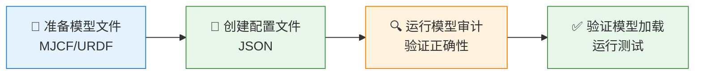

# 09 机器人模型替换

> ⚠️ 本文档对应 v1 课程结构。v2 正文请参见 `tutorials/v2/`。本文档所有 `nq/nv` 数值均为 v1 旧值（`nq=6, nv=6`）；v2 实际为 `nq=13, nv=12`（自由基座 7 + 6 关节），请勿用于 v2 验证。

> 📗 **难度**：★★☆☆☆（基础）— 需要理解接口契约和配置流程
> 对应仓库 commit: d2c1f6f
> 最后验证日期: 2026-07-03
> 运行环境: Windows + Python 3.11 + MuJoCo

---

## 1. 本节学习目标

完成本节后，你应该能够：

- **理解** RobotSpec 接口契约
- **实现** 为新机器人创建配置文件
- **验证** 模型替换的正确性
- **掌握** 模型替换的最佳实践

---

## 2. 前置知识

开始本节前，建议你已经完成：

- Lesson 08: Residual RL

你需要理解的概念：

- MuJoCo 模型结构
- JSON 配置文件格式

---

## 3. 本节涉及的文件

| 文件 | 作用 |
|------|------|
| `src/upkie_mujoco_course/model/robot_spec.py` | RobotSpec 接口 |
| `configs/robot/upkie.json` | Upkie 配置文件 |
| `docs/MODEL_SWAP_GUIDE.md` | 模型替换指南 |
| `scripts/01_check_model.py` | 模型审计脚本 |

---

## 4. 核心概念：RobotSpec 接口

### 4.1 什么是 RobotSpec

**RobotSpec** 是机器人模型的接口契约，定义了：

1. **模型路径**：MJCF/URDF 文件位置
2. **关节映射**：关节名称和类型
3. **执行器映射**：执行器名称和类型
4. **默认姿态**：初始姿态配置

### 4.2 接口契约

```python
@dataclass
class RobotSpec:
    """机器人规格定义。"""
    model_path: str                    # 模型文件路径
    base_body: str                     # 基座 body 名称
    root_joint: str                    # 根关节类型
    wheel_joints: list[str]            # 轮子关节列表
    leg_joints: dict[str, str]         # 腿部关节映射
    actuators: dict[str, str]          # 执行器映射
    default_pose: dict[str, dict]      # 默认姿态配置
```

### 4.3 为什么需要 RobotSpec

1. **解耦**：将模型定义与控制逻辑分离
2. **可配置**：通过 JSON 文件配置，无需修改代码
3. **可验证**：可以通过审计脚本验证配置正确性
4. **可复用**：同一套控制器可以用于不同模型

---

## 5. 代码详解

### 5.1 RobotSpec 实现

**文件**：`src/upkie_mujoco_course/model/robot_spec.py`

```python
"""RobotSpec 接口。"""
from __future__ import annotations

from dataclasses import dataclass
from pathlib import Path

import json


@dataclass
class RobotSpec:
    """机器人规格定义。"""
    model_path: str
    base_body: str
    root_joint: str
    wheel_joints: list[str]
    leg_joints: dict[str, str]
    actuators: dict[str, str]
    default_pose: dict[str, dict]

    @classmethod
    def from_json(cls, config_path: str) -> "RobotSpec":
        """从 JSON 文件加载配置。

        Args:
            config_path: 配置文件路径

        Returns:
            RobotSpec 实例
        """
        with open(config_path, "r", encoding="utf-8") as f:
            config = json.load(f)

        return cls(
            model_path=config["model_path"],
            base_body=config["base_body"],
            root_joint=config["root_joint"],
            wheel_joints=config["wheel_joints"],
            leg_joints=config["leg_joints"],
            actuators=config["actuators"],
            default_pose=config["default_pose"],
        )

    def validate(self) -> bool:
        """验证配置的完整性。

        Returns:
            配置是否有效
        """
        # 检查必要字段
        if not self.model_path:
            return False
        if not self.base_body:
            return False
        if not self.wheel_joints:
            return False
        if not self.leg_joints:
            return False
        if not self.actuators:
            return False

        return True
```

### 5.2 配置文件示例

**文件**：`configs/robot/upkie.json`

```json
{
  "model_path": "assets/upkie/upkie.xml",
  "base_body": "base",
  "root_joint": "free",
  "wheel_joints": ["left_wheel", "right_wheel"],
  "leg_joints": {
    "left_hip": "left_hip",
    "left_knee": "left_knee",
    "right_hip": "right_hip",
    "right_knee": "right_knee"
  },
  "actuators": {
    "left_hip_servo": "position",
    "left_knee_servo": "position",
    "left_wheel_motor": "velocity",
    "right_hip_servo": "position",
    "right_knee_servo": "position",
    "right_wheel_motor": "velocity"
  },
  "default_pose": {
    "stand": {
      "left_hip": 0.0,
      "left_knee": 0.0,
      "right_hip": 0.0,
      "right_knee": 0.0
    },
    "crouch": {
      "left_hip": -0.3,
      "left_knee": -0.8,
      "right_hip": -0.3,
      "right_knee": -0.8
    }
  }
}
```

---

## 6. 模型替换流程

> 📌 **飞书用户请使用"文本绘图小组件"插入以下图表**



### 6.1 步骤 1：准备模型文件

创建新的 MJCF/URDF 模型文件，放置在 `assets/` 目录下：

```
assets/
└── new_robot/
    └── new_robot.xml
```

### 6.2 步骤 2：创建配置文件

在 `configs/robot/` 目录下创建新的 JSON 配置文件：

```json
{
  "model_path": "assets/new_robot/new_robot.xml",
  "base_body": "base",
  "root_joint": "free",
  "wheel_joints": ["left_wheel", "right_wheel"],
  "leg_joints": {
    "left_hip": "left_hip",
    "left_knee": "left_knee",
    "right_hip": "right_hip",
    "right_knee": "right_knee"
  },
  "actuators": {
    "left_hip_servo": "position",
    "left_knee_servo": "position",
    "left_wheel_motor": "velocity",
    "right_hip_servo": "position",
    "right_knee_servo": "position",
    "right_wheel_motor": "velocity"
  },
  "default_pose": {
    "stand": {
      "left_hip": 0.0,
      "left_knee": 0.0,
      "right_hip": 0.0,
      "right_knee": 0.0
    },
    "crouch": {
      "left_hip": -0.3,
      "left_knee": -0.8,
      "right_hip": -0.3,
      "right_knee": -0.8
    }
  }
}
```

### 6.3 步骤 3：运行模型审计

```powershell
python scripts/01_check_model.py --config configs/robot/new_robot.json
```

### 6.4 步骤 4：验证模型加载

```powershell
pytest tests/test_model_loads.py -v
pytest tests/test_config_loads.py -v
```

---

## 7. 运行与验证

### 7.1 运行命令

```powershell
# 使用默认配置
python scripts/01_check_model.py

# 使用新配置
python scripts/01_check_model.py --config configs/robot/new_robot.json
```

### 7.2 预期输出

```
=== 模型审计 ===
配置文件: configs/robot/new_robot.json
模型路径: assets/new_robot/new_robot.xml

nq=6, nv=6, nu=6

Bodies:
  - world
  - base
  - left_hip
  - left_knee
  - left_wheel
  - right_hip
  - right_knee
  - right_wheel

Joints:
  - left_hip: hinge, range=[-0.5, 0.5]
  - left_knee: hinge, range=[-1.5, 0.0]
  - left_wheel: hinge, range=free
  - right_hip: hinge, range=[-0.5, 0.5]
  - right_knee: hinge, range=[-1.5, 0.0]
  - right_wheel: hinge, range=free

Actuators:
  - left_hip_servo: position
  - left_knee_servo: position
  - left_wheel_motor: velocity
  - right_hip_servo: position
  - right_knee_servo: position
  - right_wheel_motor: velocity

审计通过！
```

---

## 8. 常见问题

| 现象 | 可能原因 | 解决方法 |
|------|----------|----------|
| `FileNotFoundError` | 模型文件路径错误 | 检查 `model_path` |
| `KeyError` | 配置字段缺失 | 检查 JSON 配置完整性 |
| `ValueError` | 关节名称不匹配 | 检查 `leg_joints` 映射 |
| `模型加载失败` | MJCF 格式错误 | 检查 XML 文件语法 |

---

## 9. 面试题精选

### Q1：为什么需要 RobotSpec 接口？

**A**：
1. **解耦**：将模型定义与控制逻辑分离
2. **可配置**：通过 JSON 文件配置，无需修改代码
3. **可验证**：可以通过审计脚本验证配置正确性
4. **可复用**：同一套控制器可以用于不同模型

### Q2：如何为新机器人创建配置？

**A**：
1. **准备模型文件**：创建 MJCF/URDF 文件
2. **创建配置文件**：定义关节映射和执行器映射
3. **运行审计**：验证配置正确性
4. **测试加载**：运行测试确保模型能正确加载

### Q3：模型替换时需要注意什么？

**A**：
1. **关节映射**：确保关节名称与模型一致
2. **执行器类型**：确保执行器类型正确（position/velocity）
3. **默认姿态**：确保默认姿态在关节限制内
4. **测试验证**：运行审计和测试确保正确性

---

## 10. 延伸学习

### 10.1 进阶主题

1. **多模型支持**：如何在一个项目中支持多个机器人
2. **模型参数辨识**：如何从真实机器人获取模型参数
3. **模型简化**：如何简化复杂模型以提高仿真效率

### 10.2 推荐阅读

1. **MuJoCo 模型文档**：https://mujoco.org/documentation#XML
2. **URDF 规范**：http://wiki.ros.org/urdf

---

## 11. 下一节预告

下一节将学习：
- 高层指令接口
- 命令解析与执行
- VLA/VLM/LLM 集成展望
