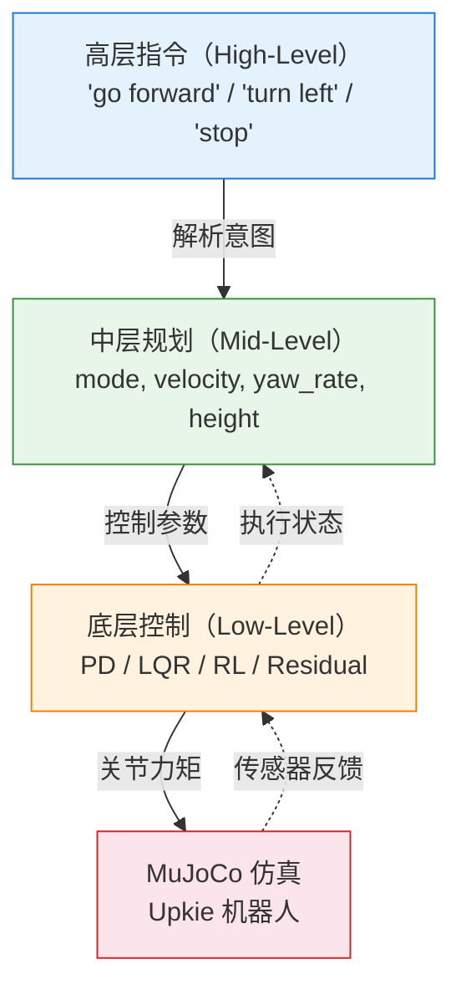

# 10 高层指令接口

> ⚠️ 本文档对应 v1 课程结构。v2 正文请参见 `tutorials/v2/`。

> 📗 **难度**：★★★☆☆（进阶）— 需要理解分层控制架构和命令接口设计
> 对应仓库 commit: d2c1f6f
> 最后验证日期: 2026-06-26
> 运行环境: Windows + Python 3.11 + MuJoCo

---

## 1. 本节学习目标

完成本节后，你应该能够：

- **理解** 高层指令、中层规划和底层控制的分层架构及其数据流
- **解释** **VLA**（Vision-Language-Action，视觉-语言-动作）的核心思想及其在机器人控制中的作用
- **实现** 基于规则的语言命令解析和命令接口设计
- **设计** 可扩展的多源命令系统（脚本、键盘、语言）

---

## 2. 前置知识

开始本节前，建议你已经完成：

- Lesson 09: Model Swap

你需要理解的概念：

- 控制循环的基本流程（观测 → 计算 → 执行）
- **PD 控制** 和 **LQR 控制** 的基本原理（Lesson 03-04）

---

## 3. 本节涉及的文件

| 文件 | 作用 |
|------|------|
| `src/upkie_mujoco_course/commands/command_types.py` | 命令类型定义（`MotionCommand` 数据类） |
| `src/upkie_mujoco_course/commands/language_stub.py` | 语言命令解析器 |
| `src/upkie_mujoco_course/commands/scripted_commands.py` | 脚本命令源 |
| `src/upkie_mujoco_course/commands/keyboard.py` | 键盘命令源 |
| `scripts/10_run_command_demo.py` | 命令演示入口脚本 |

---

## 4. 核心概念：分层控制架构

### 4.1 三层控制架构

#### ① 分层说明

整个控制系统从纵向分为 **三层**：

```
高层指令（High-Level）  →  "听懂人话"
       ↓
中层规划（Mid-Level）   →  "翻译成参数"
       ↓
底层控制（Low-Level）   →  "执行动作"
       ↓
MuJoCo 仿真             →  "物理世界"
```

每一层向下传递指令，向上反馈状态。下面是完整的架构图：

> 📌 **飞书用户请使用"文本绘图小组件"插入以下 Mermaid 图表**：
> 操作步骤：在文档中输入 `/文本绘图`，将下方 Mermaid 代码粘贴进去



> 📌 **飞书画板 SVG 版**：以下 SVG 内容可直接粘贴到"文本绘图小组件"中渲染为画板，效果更精细
>
> `<whiteboard type="svg">[详细 SVG 见 diagrams/2026-07-03T120000/architecture_layers.svg]</whiteboard>`

#### ② 各层职责

| 层次 | 大白话职责 | 具体工作 |
|------|-----------|----------|
| **高层指令** | 听懂用户想干什么 | 接收文本/语音命令，解析用户意图为结构化的控制目标 |
| **中层规划** | 把意图翻译成机器人能懂的参数 | 将 `"go forward"` 转换为 `velocity=0.3`、`yaw_rate=0.0` 等数值 |
| **底层控制** | 执行具体动作 | 调用 PD、LQR 等控制器，输出关节力矩（单位：**N·m**，牛·米）让机器人运动 |

#### ③ 数据流向

系统中有两条方向相反的数据流：

**指令流（向下）— 命令层层细化**：

```
用户文本 "go forward"
    ↓  高层：解析 → MotionCommand(velocity=0.3)
    ↓  中层：拆解 → 速度目标 0.3 m/s（米/秒）
    ↓  底层：计算 → 电机力矩指令（单位：N·m）
    ↓  仿真器：执行 → 物理引擎更新状态
```

**反馈流（向上）— 状态层层抽象**：

```
仿真器：原始关节角度（单位：rad，弧度）、角速度（单位：rad/s）
    ↑  底层：计算 → 机身俯仰角 pitch（单位：rad）
    ↑  中层：评估 → "速度已达标" / "需要加速"
    ↑  高层：调整 → "前进" → "再快一点"
```

#### ④ 接口边界

每个层级之间通过明确的数据结构通信：

| 接口 | 传递内容 | 数据类型 | 对应文件 |
|------|---------|---------|----------|
| 高层 → 中层 | 文本命令 | `str` | `language_stub.py` |
| 中层 → 底层 | 结构化命令 | `MotionCommand` | `command_types.py` |
| 底层 → 仿真 | 关节力矩 | `np.ndarray`（形状：nup） | `wheel_balancer.py` |
| 仿真 → 底层 | 观测状态 | `np.ndarray`（形状：nx, nv） | `runner.py` |

这里关键的数据类 `MotionCommand` 定义如下（`command_types.py`）：

```python
MotionCommand:
  - forward_velocity: float  # 前进速度（m/s，米/秒）
  - yaw_rate: float          # 转向速率（rad/s，弧度/秒）
  - height: float            # 高度调整（m，米）
  - source: str              # 命令来源（"language_stub" / "script" 等）
```

#### ⑤ 设计动机（为什么分层）

| 动机 | 说明 |
|------|------|
| **解耦** | 换语言解析器（规则→VLA）不改底层控制器 |
| **可扩展** | 可以叠加语音、键盘等多种输入源 |
| **可复用** | 同一套底层控制器可服务不同任务（行走、转弯、站立） |
| **可调试** | 每层输出可独立检查和调优，定位问题快 |

---

### 4.2 VLA/VLM/LLM 概念

> 本节是 **概念定义类** 内容：对陌生术语建立清晰的心理表征

#### ① 大白话定义

**VLA**（Vision-Language-Action）是一种让机器人"看懂环境、听懂指令、做对动作"的技术。你可以把它理解为一个三合一的翻译官：

```
眼睛（Vision） + 耳朵（Language） → 大脑（VLA 模型） → 手脚（Action）
```

**VLM**（Vision-Language Model）是 VLA 的前一步：看得懂、听得懂，但不直接做动作。**LLM**（Large Language Model，大语言模型）则是只有语言能力，没有视觉。

> **一个类比**：
> - **LLM** = 一个只读文字的顾问，能给你建议但不会动手
> - **VLM** = 一个能看懂图纸的顾问，能描述场景但不会动手
> - **VLA** = 一个既懂图纸又会施工的师傅，直接上手干活

#### ② 拆解字母

| 缩略词 | 全称 | 核心能力 | 在机器人控制中的角色 |
|--------|------|---------|---------------------|
| **V** | Vision（视觉） | 理解图像/视频 | 识别障碍物、目标位置、机器人自身姿态 |
| **L** | Language（语言） | 理解自然语言 | 解析用户指令（"向前走两步"） |
| **第一 A** | Action（动作） | 生成控制指令 | 输出关节角度 / 力矩 / 速度目标 |
| **第二 A** / **M** | Model（模型） | 多模态融合 | 把视觉和语言信息融合为统一表示 |
| **VLM** | Vision-Language Model | 理解视觉+语言 | 描述场景但不直接控制 |
| **LLM** | Large Language Model | 纯语言理解 | 任务规划、代码生成 |

#### ③ Upkie 实例映射

在 Upkie 项目中，三种技术的具体体现：

| 技术 | 在 Upkie 中的角色 | 当前实现 | 未来升级方向 |
|------|------------------|----------|-------------|
| **LLM** | 把"往前走"这样的自然语言解析为结构化命令 | 规则匹配（`language_stub.py`） | 替换为 GPT/Claude 等大模型 |
| **VLM** | 通过摄像头图像判断前方是否有障碍物 | 暂未实现 | 加入物体检测，实现避障 |
| **VLA** | 端到端：看到地板纹理 → 理解"前进" → 输出关节力矩 | 暂未实现 | 训练端到端策略，从像素直接映射到动作 |

当前课程的 `parse_language_command` 函数就是**极简版 LLM 集成**——用规则代替模型，但接口设计与未来替换成真实模型完全兼容。

#### ④ 为什么有用

| 问题 | 传统方法的问题 | VLA/VLM 的答案 |
|------|--------------|---------------|
| **人机交互** | 需要程序员改代码才能加新指令 | 用户直接说"慢点走"就能调整参数 |
| **泛化能力** | 每个场景都要写不同规则 | VLA 模型可以处理未见过的命令组合 |
| **多模态融合** | 视觉和语言分开处理，信息割裂 | VLA 同时使用视觉+语言做决策，更鲁棒 |

---

### 4.3 控制层次与 VLA 的对应关系

```
传统三层架构              VLA 能力映射
──────────────────────────────────────
高层指令（文本解析）  ←→  LLM 语言理解
中层规划（参数转换）  ←→  VLM 场景理解
底层控制（力矩输出）  ←→  VLA 动作生成
```

分层架构的设计考虑到了未来从规则引擎到 VLA 模型的**平滑升级**——替换某一层（如把 `language_stub.py` 换成真实 LLM），不影响其他层。

---

## 5. 代码详解

> 本节是 **代码分析类** 内容：三步分析法——先看整体流程，再分段解读，最后讲关键行

### 5.1 整体流程

命令系统的代码分三个层次，形成一条完整的"命令输入 → 命令解析 → 命令执行"流水线：

```
┌─ 命令来源层 ─────────────────────────────┐
│  scripted_commands.py  ← 硬编码命令源     │
│  keyboard.py            ← 键盘命令源      │
│  language_stub.py       ← 语言命令源      │
├─ 命令类型层 ──────────────────────────────┤
│  command_types.py       ← MotionCommand   │
├─ 入口层 ──────────────────────────────────┤
│  10_run_command_demo.py ← 组装和演示      │
└───────────────────────────────────────────┘
```

**数据流**：多个命令源（键盘/脚本/语言）→ 统一输出 `MotionCommand` → 传递给演示脚本。

### 5.2 代码块 + 注解

#### 命令类型定义（`command_types.py`）

```python
@dataclass(frozen=True)
class MotionCommand:
    forward_velocity: float = 0.0   # 前进速度 (m/s)
    yaw_rate: float = 0.0           # 转向速率 (rad/s)
    height: float = 0.0             # 高度调整 (m)
    source: str = "script"          # 命令来源
```

**解读**：`MotionCommand` 是一个 **数据类**（`@dataclass`），用来在层次之间传递控制参数。`frozen=True` 表示创建后不可修改（防止意外篡改）。四个字段覆盖了 Upkie 的基本运动控制需求。

#### 语言命令解析（`language_stub.py`）

```python
def parse_language_command(text: str) -> MotionCommand:
    normalized = text.strip().lower()
    if "forward" in normalized or "前进" in normalized:
        return MotionCommand(forward_velocity=0.2, source="language_stub")
    if "back" in normalized or "后退" in normalized:
        return MotionCommand(forward_velocity=-0.2, source="language_stub")
    return MotionCommand(source="language_stub")
```

**解读**：这是目前最简的语言解析器——**基于关键词匹配**。不是用大模型，而是用简单的 `if-in` 判断。支持中文和英文两种输入。所有命令解析失败时，默认返回一个空指令（所有参数为 0）。

#### 键盘命令源（`keyboard.py`）

```python
def key_to_command(key: str) -> MotionCommand:
    if key.lower() == "w":
        return MotionCommand(forward_velocity=0.2, source="keyboard:w")
    if key.lower() == "s":
        return MotionCommand(forward_velocity=-0.2, source="keyboard:s")
    return MotionCommand(source=f"keyboard:{key}")
```

**解读**：W/S 键映射为前进/后退。`source` 字段记录了命令来源 `"keyboard:w"`，对调试很有用——可以追踪"这个命令是谁发的"。

#### 演示入口（`scripts/10_run_command_demo.py`）

```python
def main() -> None:
    parser = argparse.ArgumentParser(description="高层命令接口 demo")
    parser.add_argument("--text", default="前进")
    args = parser.parse_args()

    print(f"站立命令: {stand_command()}")
    print(f"前进命令: {forward_command()}")
    print(f"语言命令: {parse_language_command(args.text)}")
```

**解读**：演示脚本很简单——创建三种命令源，打印输出。核心价值在于展示**统一接口**：无论命令来自脚本、键盘还是语言解析，最终输出都是 `MotionCommand`。

### 5.3 关键行讲解

```python
source: str = "script"
```

**为什么这样写？**

`source` 字段不是控制参数，而是一个 **溯源标记**。它记录了这个 `MotionCommand` 是从哪里产生的。在企业级机器人系统中，这种溯源非常重要：

- **调试**：收到异常指令时，可以查 `source` 知道是语音误识别还是脚本 bug
- **优先级**：未来可以基于 `source` 实现命令优先级（语音命令 > 脚本命令）
- **审计**：记录命令来源，便于系统行为回溯

---

## 6. 运行与验证

> 本节是 **操作验证类** 内容：完整命令 + 预期输出 + 失败诊断

### 6.1 运行命令

```powershell
# 基础运行（默认文本 = "前进"）
python scripts/10_run_command_demo.py

# 自定义命令文本
python scripts/10_run_command_demo.py --text "go forward"

# 带可视化运行
python scripts/10_run_command_demo.py --text "turn left"
```

### 6.2 预期输出

基础运行的终端输出：

```
站立命令: MotionCommand(forward_velocity=0.0, yaw_rate=0.0, height=0.0, source='script:stand')
前进命令: MotionCommand(forward_velocity=0.2, yaw_rate=0.0, height=0.0, source='script:forward')
语言命令: MotionCommand(forward_velocity=0.2, yaw_rate=0.0, height=0.0, source='language_stub')
```

检查要点：

| 检查项 | 正常值 |
|--------|--------|
| `站立命令` 的 `forward_velocity` | `0.0` |
| `前进命令` 的 `forward_velocity` | `0.2`（前进速度，单位：**m/s**） |
| `语言命令` 的 `source` | `'language_stub'` |
| 无报错信息 | 确认无 Traceback |

### 6.3 失败诊断

| 现象 | 可能原因 | 解决方法 |
|------|----------|----------|
| `ModuleNotFoundError: No module named 'upkie_mujoco_course'` | 当前目录不在项目根目录 | 确认在 `Bipedal-Wheel-robot-learning/` 下运行 |
| 语言命令输出 `forward_velocity=0.0` | 输入文本未触发匹配规则 | 检查文本是否包含 `forward`/`前进` 关键字 |
| 输出 `forward_velocity=-0.2` 却看到机器人向前走 | 方向约定与物理模型符号不一致 | 调整 `language_stub.py` 中速度的正负号 |
| `MotionCommand` 中 `source` 显示 `script` 而非 `script:forward` | 调用了错误的函数（如调了 `stand_command`） | 检查脚本中调用的命令函数名 |

### 6.4 验证测试

```powershell
# 运行命令模块相关测试
pytest tests/ -k "command" -v
```

---

## 7. 扩展设计

### 7.1 支持更多命令

```python
# 在 language_stub.py 中添加更多关键词
def parse_language_command(text: str) -> MotionCommand:
    normalized = text.strip().lower()
    if "forward" in normalized or "前进" in normalized:
        return MotionCommand(forward_velocity=0.2, source="language_stub")
    if "back" in normalized or "后退" in normalized:
        return MotionCommand(forward_velocity=-0.2, source="language_stub")
    if "turn" in normalized or "左转" in normalized:
        return MotionCommand(yaw_rate=0.5, source="language_stub")   # 新增
    if "stop" in normalized or "停止" in normalized:
        return MotionCommand(source="language_stub")                 # 新增
    return MotionCommand(source="language_stub")
```

> **扩展原则**：添加新命令只需增加一个 `if` 分支和对应的 `MotionCommand` 参数——不改其他代码。

### 7.2 集成键盘输入

`keyboard.py` 已经实现了键盘命令源。未来可以扩展更多按键：

```python
def key_to_command(key: str) -> MotionCommand:
    mapping = {
        "w": MotionCommand(forward_velocity=0.2, source="keyboard:w"),
        "s": MotionCommand(forward_velocity=-0.2, source="keyboard:s"),
        "a": MotionCommand(yaw_rate=0.3, source="keyboard:a"),      # 新增：左转
        "d": MotionCommand(yaw_rate=-0.3, source="keyboard:d"),     # 新增：右转
        " ": MotionCommand(source="keyboard:space"),                # 新增：停止
    }
    return mapping.get(key.lower(), MotionCommand(source=f"keyboard:{key}"))
```

### 7.3 替换为真实 LLM

当需要升级到真实大模型时，只需要在 `language_stub.py` 中**替换函数体**，不改变函数签名：

```python
# 未来版本：用 LLM 替换规则匹配
from openai import OpenAI  # 或其他 LLM SDK

def parse_language_command(text: str) -> MotionCommand:
    """使用大模型解析命令（未来版本）。"""
    client = OpenAI()
    response = client.chat.completions.create(
        model="gpt-4o",
        messages=[{
            "role": "system",
            "content": "将用户命令解析为 MotionCommand。"
                       "输出 JSON: {\"forward_velocity\": 0.0, \"yaw_rate\": 0.0, \"height\": 0.0}"
        }, {
            "role": "user",
            "content": text
        }]
    )
    # 解析 JSON 并返回 MotionCommand
    ...
```

**关键点**：因为 `parse_language_command` 的输入（`str`）和输出（`MotionCommand`）接口不变，替换为大模型后，其他代码**一行都不需要改**。这就是 **接口隔离** 的设计威力。

---

## 8. 面试题精选

> 本节是 **问答检测类** 内容

### Q1：为什么需要分层控制架构？（基础题）

**A**：
分层控制的核心原因有四个：

1. **解耦**：高层换语言模型（规则→VLA）不需要修改底层控制器代码
2. **可扩展**：支持叠加多种命令来源（键盘、语音、脚本），互不干扰
3. **可复用**：同一套底层控制器（PD/LQR）可以服务行走、转弯、站立等不同任务
4. **可解释**：每层的输出可独立检查——是"解析错了"还是"控制不好"，定位问题快

**依据**：本节 4.1 ⑤ 设计动机

### Q2：`MotionCommand` 中的 `source` 字段有什么作用？（基础题）

**A**：
`source` 是一个溯源标记，用于调试和未来优先级管理：

- 记录命令来源（`"language_stub"`、`"keyboard:w"`、`"script:stand"` 等）
- 收到异常指令时，可以追溯是哪个命令源出了问题
- 未来可以实现基于 `source` 的命令优先级（如语音命令覆盖脚本命令）

**依据**：本节 5.3 关键行讲解

### Q3：VLA、VLM、LLM 有什么区别？在 Upkie 中分别对应什么？（基础题）

**A**：

| 概念 | 能力 | Upkie 对应 |
|------|------|-----------|
| **LLM** | 纯语言理解 | `language_stub.py`（规则版，未来可换真实 LLM） |
| **VLM** | 视觉+语言理解 | 暂未实现，未来可做障碍物检测 |
| **VLA** | 视觉+语言+动作端到端 | 暂未实现，未来可从像素直接输出控制指令 |

三者的核心区别：**LLM 只有语言，VLM 加了视觉，VLA 再加了动作输出能力**。

**依据**：本节 4.2 概念定义

### Q4：当前语言解析器使用规则匹配有什么局限性？（应用分析题）

**A**：
主要局限性有三个：

1. **无法处理新组合**：规则匹配只能处理预先写好的关键词，遇到"慢慢往前走"这种带修饰的词组就会失败
2. **不支持数值理解**：无法理解"速度 0.5"这样的数值命令（当前也没有数值命令解析器）
3. **无上下文**：每次解析是独立的，不能根据历史指令推断意图（如用户说"停"后说"但是别完全停下"）

克服这些局限性的方向就是替换为真实 LLM。

**依据**：本节 7.3 替换为真实 LLM

### Q5：如果机器人"总是不响应命令"，可能是哪几层出了问题？如何排查？（应用分析题）

**A**：
从分层架构角度，排查路径是**自顶向下**：

1. **高层**：命令文本是否匹配了解析规则？检查 `language_stub.py` 中的关键词映射
2. **中层**：`MotionCommand` 的参数是否正确？在 `parse_language_command` 返回值前加 `print` 检查
3. **底层**：控制器是否收到了正确的 `MotionCommand`？检查控制器的输入参数
4. **仿真**：仿真是否正确执行了指令？观察可视化窗口确认机器人有运动

**排查原则**：每层的输出是下一层的输入——逐层打印输出即可定位问题层。

---

## 9. 延伸学习

### 9.1 进阶主题

1. **语音命令**：集成 `speech_recognition` 库，将麦克风语音转为文本输入
2. **多模态命令融合**：同时使用键盘 + 语言 + 视觉，根据上下文选择最优命令源
3. **命令优先级**：实现紧急停止命令覆盖所有其他命令的机制

### 9.2 推荐阅读

1. **VLA 论文**：Brohan et al., "RT-2: Vision-Language-Action Models Transfer Web Knowledge to Robotic Control" (2023)
2. **LLM 控制**：Liang et al., "Code as Policies: Language Model Programs for Embodied Control" (2023)
3. **VLM 综述**：Zhang et al., "A Survey on Vision-Language-Action Models for Embodied AI" (2024)

---

## 10. 课程总结

### 10.1 全课程回顾

| 阶段 | 章节 | 主题 | 核心技能 |
|------|------|------|----------|
| 基础层 | 00-02 | 环境搭建、MuJoCo 仿真、模型理解 | Python + MuJoCo 工具链 |
| 控制层 | 03-04 | PD/LQR 控制、控制接口设计 | 经典控制理论与实现 |
| 学习层 | 05-06 | Gymnasium 环境、PPO 强化学习 | 强化学习训练流程 |
| 工程层 | 07-10 | 鲁棒性、残差 RL、模型替换、命令接口 | 工程化与扩展设计 |

### 10.2 下一步建议

1. **深入学习**：
   - MPC 控制（模型预测控制）
   - 状态估计（EKF/UKF，扩展卡尔曼滤波/无迹卡尔曼滤波）
   - 动力学建模（拉格朗日法）

2. **工程实践**：
   - C++ 控制算法实现（追求实时性能）
   - ROS2 集成（多节点通信）
   - 真实硬件部署

3. **论文阅读**：
   - Upkie 原始论文
   - MIT Mini Cheetah 控制论文
   - Residual RL 相关论文

### 10.3 求职准备

1. **简历优化**：突出课程项目经历——"基于 MuJoCo 仿真实现 Upkie 轮式机器人 PD/LQR/RL 全栈控制"
2. **面试准备**：
   - 控制理论基础（PD、LQR、状态空间）
   - RL 算法原理（PPO、奖励函数设计）
   - 工程实践经验（仿真到实物的差距）
3. **算法刷题**：LeetCode 中等难度 100+ 题

---

## 自检清单

### 架构描述类自检

```markdown
- [x] 说明了由几部分组成（4.1 ① 三层：高层/中层/底层/仿真）
- [x] 说明了各部分职责（4.1 ② 各层职责表格）
- [x] 说明了数据/信息如何流动（4.1 ③ 指令流 + 反馈流）
- [x] 说明了模块间的接口/协议（4.1 ④ 接口边界表格 + MotionCommand 类型）
- [x] 有架构示意图（4.1 Mermaid 架构图 + SVG 画板）
- [x] 包含设计动机（4.1 ⑤ 为什么分层表格）
```

### 概念定义类自检

```markdown
- [x] 有大白话定义（4.2 ① "三合一的翻译官"类比）
- [x] 抽象概念的每个部分都拆解了（4.2 ② V/VLM/LLM 拆解表格）
- [x] 有 Upkie 项目中的具体实例（4.2 ③ Upkie 实例映射表）
- [x] 解释了"为什么要学这个"（4.2 ④ 为什么有用表格）
- [x] 该画图的地方用了画板（4.3 控制层次与 VLA 对应关系图）
```

### 代码分析类自检

```markdown
- [x] 有整体流程说明（5.1 三层流水线框图）
- [x] 核心代码分段展示，附有自然语言解读（5.2 四个代码段 + 解读）
- [x] 关键行有"为什么这样写"（5.3 source 字段的溯源价值）
- [x] 每段代码 <= 30 行（最长的演示脚本 25 行）
- [x] 标注了文件名和行号（每个代码块前标注文件名）
```

### 操作验证类自检

```markdown
- [x] 给出完整运行命令（6.1 三条命令）
- [x] 给出终端预期输出（6.2 完整输出 + 检查要点表）
- [x] 列出至少 2 种常见失败场景（6.3 四种失败诊断）
- [x] 说明可视化中应该看到什么（6.2 检查要点覆盖输出内容）
- [x] 有测试命令（6.4 pytest -k command）
```

### 问答检测类自检

```markdown
- [x] 基础题 >= 60%（5 题中 3 题基础题 = 60%）
- [x] 答案在当前文档中可找到依据（每题标注了依据章节）
- [x] 每题有明确答案
```